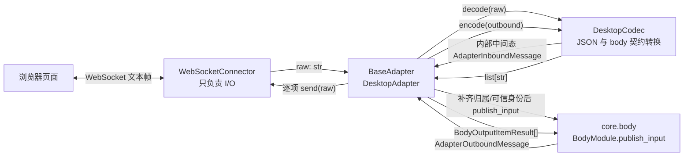

# Adapter 层设计方案（MVP）

> 状态：MVP 设计定稿　|　目标读者：Adapter 层开发者、组合根维护者

## 1. 背景与目标

### 1.1 现状

`core` 内三个 MVP 已完成（body / event / memory）。body 已经为 Adapter 固定了最小契约：`BodyAdapter` 协议、`AdapterRegistry`、`AdapterInboundMessage`、`AdapterOutboundMessage`、`BodyModule.publish_input`。

### 1.2 定位

`src/adapter` 是 core 之外唯一的翻译层，**只与 body 交互**：

- 入站：平台输入 → `AdapterInboundMessage` → `BodyModule.publish_input`；
- 出站：body 路由 → `adapter.send(AdapterOutboundMessage)` → 平台发送 → `list[BodyOutputItemResult]`。

Adapter 不发布任何事件、不持有 EventClient、不接触 `core.event` / `core.memory`。

### 1.3 MVP 范围

只实现 desktop，只支持文本消息：

- 一个可运行、可测试的 Desktop 适配器；
- 与 body 现有契约完全兼容，**不改 `core.body`**；
- 传输使用 WebSocket：浏览器页面通过本地 WebSocket 连接 Adapter，每个消息帧是一个 JSON 字符串；仅引入 `websockets` 一个第三方依赖；
- 严格只维护一个 active browser connection，避免浏览器之间消息串线。

### 1.4 非目标（明确不做）

媒体、多平台、通用重连框架、注册元数据、生命周期事件、状态统计、身份映射/认证体系、配置体系、错误码体系、消息级重试、多连接与按连接路由。每一项的引入触发条件见[第 10 节](#10-延迟引入清单)。

## 2. 分层与依赖



依赖规则：

- `src/adapter` 只依赖 `core.body` 的公开契约；入站入口由组合根注入，因此不依赖 `core.event`；
- Connector 只收发原始字符串，不解析 JSON，不构造 body 契约；
- Codec 只处理 wire format 与 body 契约之间的转换，不理解 WebSocket、连接或重连；
- 原始平台/传输对象不得越过 `AdapterInboundMessage` / `AdapterOutboundMessage` 边界；
- 不修改 `core.body` 的任何契约或实现。

## 3. 核心抽象（三个接缝）

新增平台时主要实现 `Connector + Codec`，再提供一个很薄的 Adapter 配置或子类；`BaseAdapter` 主流程无需修改。不承诺严格只增加两个文件。

### 3.1 Connector（传输）

```python
class Connector(Protocol):
    """传输接缝：运行传输服务、接收及发送原始字符串。"""

    on_message: Callable[[str], Awaitable[None]] | None

    async def run(self) -> None: ...
    async def send(self, raw: str) -> None: ...
    async def close(self) -> None: ...
```

- Connector 只做 I/O；它不解析或生成 JSON，也不构造 body 契约；
- `run()` 表示整个传输服务正在运行，不表示某个浏览器连接的生命周期；单个浏览器断开后，WebSocket server 继续监听，`run()` 不退出；
- Desktop 的 `WebSocketConnector` 是本地 WebSocket 服务端，浏览器直接接入；
- Desktop MVP 只保存一个 active connection。第二个连接在握手完成后立即使用明确且可测试的 WebSocket close code/reason 拒绝，旧连接保持不变；不设计完整错误协议或错误码体系，也不做连接排队、抢占或广播；
- `send(raw)` 只向当前 active connection 发送该字符串；没有 active connection 时抛出传输异常，由 `BaseAdapter.send()` 收敛为失败结果；
- 重连是具体 Connector 的传输职责：服务端场景由浏览器自行重连；未来客户端模式接入外部平台时在各自 Connector 内实现，不建通用重连框架。

### 3.2 Codec（编解码）

```python
class Codec(Protocol):
    """编解码接缝：wire format <-> body 契约。"""

    def decode(self, raw: str) -> AdapterInboundMessage: ...
    def encode(self, outbound: AdapterOutboundMessage) -> list[str]: ...
```

- `decode` 负责 JSON 反序列化、字段校验以及用现有 body 类型构造 Adapter 内部中间态。该 `AdapterInboundMessage` 尚不可发布：`adapter_type/platform` 占位值没有真实语义，wire input 中的 `user_id/display_name` 即使存在也没有可信身份语义；解析失败抛 `CodecError`，由 `BaseAdapter` 捕获、记录并跳过；
- `encode` 负责从 body 出站契约选择允许公开的字段，并完成 JSON 序列化；返回可直接交给 Connector 的字符串列表；
- 返回列表按顺序逐项发送，列表下标即 `BodyOutputItemResult.index`；
- Codec 不接触 WebSocket，不管理连接，也不执行发送。

### 3.3 BaseAdapter（骨架）

```python
class BaseAdapter(ABC):
    adapter_type: ClassVar[str]
    platform: ClassVar[str]

    def __init__(
        self,
        connector: Connector,
        codec: Codec,
        publish_input: InboundPublisher,
    ) -> None:
        ...

    async def start(self) -> None: ...
    async def stop(self) -> None: ...
    async def send(self, outbound: AdapterOutboundMessage) -> list[BodyOutputItemResult]:
        """encode -> 逐项发送原始字符串 -> 逐项结果。"""
        ...
```

`InboundPublisher` 只是类型别名，不是新机制：

```python
InboundPublisher = Callable[[AdapterInboundMessage], Awaitable[BodyInputEventData | None]]
```

组合根把它绑定到 `BodyModule.publish_input`（见[第 7 节](#7-组合根装配)）。`BaseAdapter` 不直接导入 body 的 runtime 或 events。

不变式：

- `adapter_type` / `platform` 只来自 Adapter 自身，Codec 不得从浏览器输入中采信这些字段；
- `AdapterInboundMessage` 的真实定义是可变的 `@dataclass(slots=True)`，不是 frozen 类型。其必填字段必须在初始化时提供，所以 DesktopCodec 可用占位值完整初始化；该对象此时只是 Adapter 内部中间态。`BaseAdapter` 必须在发布前覆盖 `adapter_type/platform`，`DesktopAdapter` 必须覆盖固定 owner 的 `user_id/display_name`；这是现有契约下可实现的 MVP 补齐方式，无需增加内部 DTO；
- Desktop 浏览器不提供可信身份。`DesktopAdapter` 在发布前把 `user_id/display_name` 覆盖为组合根注入的固定 owner identity；Codec 不从浏览器帧建立安全身份语义；
- **未经 Adapter 完成归属与可信身份补齐的 `AdapterInboundMessage`，不得传递给 `publish_input`，也不得越过 Adapter 边界。**
- `send()` 不把 Codec 或平台异常直接抛给 body；逐项发送异常收敛为对应的 `FAILED` 结果；
- `start()` / `stop()` 保持幂等，不增加完整状态机。

## 4. 数据流

### 入站

```text
浏览器 WebSocket 文本帧（JSON 字符串）
  -> WebSocketConnector.on_message(raw: str)
  -> DesktopCodec.decode(raw) -> Adapter 内部中间态 AdapterInboundMessage
     （坏 JSON / 缺字段 -> CodecError -> 记录并跳过）
     （adapter_type/platform 仅为初始化占位；wire 身份不可信；此时禁止发布）
  -> BaseAdapter 覆盖 adapter_type/platform（归属补齐）
  -> DesktopAdapter 覆盖组合根注入的固定 owner user_id/display_name（可信身份补齐）
  -> publish_input(message) -> body 过滤/去重/会话绑定 -> body.input.received
```

`message_id` 与文本等消息数据来自帧；身份不来自帧。若未来需要多用户身份，应引入身份映射/认证，而不是扩大浏览器字段的信任范围。

### 出站

```text
body.output.requested -> BodyRuntime 路由 -> adapter.send(outbound)
  -> DesktopCodec.encode(outbound)
     -> ['{"type":"message","text":"...","reply_to":"..."}']
  -> WebSocketConnector.send(raw: str)
  -> BaseAdapter 逐项构造 BodyOutputItemResult（成功 / 失败）
  -> body 汇总 outcome
```

不存在 `Codec.encode -> object -> BaseAdapter json.dumps -> Connector` 路径；JSON 序列化完全属于 Codec。

## 5. 目录结构与测试

```text
src/adapter/
├── __init__.py        # 公开导出：BaseAdapter、DesktopAdapter、Connector、Codec
├── base.py            # BaseAdapter + InboundPublisher
├── connector.py       # Connector 协议
├── codec.py           # Codec 协议 + CodecError
└── desktop/
    ├── __init__.py
    ├── adapter.py     # DesktopAdapter：标识、固定场景与 owner identity 补齐
    ├── connector.py   # WebSocketConnector：本地单连接 WS 服务端
    └── codec.py       # DesktopCodec：JSON 字符串 <-> body 契约
```

```text
tests/adapter/
├── test_codec.py              # 合法/缺字段/坏 JSON；出站 JSON 字符串与字段白名单
├── test_base.py               # send、encode synthetic FAILED、入站补齐后才发布、start/stop（FakeConnector）
├── test_desktop_connector.py  # 真实 WS；断开后继续监听；第二连接被拒绝
└── test_desktop_roundtrip.py  # FakeConnector + 真实 EventBus 全链路
```

Desktop 单连接测试至少验证：第一个连接保持可用；第二个连接被服务端以明确的 close code/reason 关闭；消息不会发往第二个连接；第一个连接断开后，新连接可以成为 active connection。这里只验证拒绝行为，不定义通用 WebSocket 错误协议。

## 6. Desktop MVP 细节

- 传输：`WebSocketConnector` 启动本地 WS 服务端（默认 `127.0.0.1`，端口由组合根配置），每个应用消息是一个 WebSocket 文本帧；二进制帧不属于 MVP；
- 场景：`scene_type` 固定为 `SceneType.DESKTOP`，`scene_id` 固定为 `"desktop"`；
- 入站帧：`{"type": "message", "message_id": "...", "text": "..."}`。可选的展示字段不得影响可信身份；MVP 不要求浏览器发送 `user_id`；
- 出站帧：`{"type": "message", "text": "...", "reply_to": "<id 或 null>"}`；
- metadata：DesktopCodec 不无条件透传 `AdapterOutboundMessage.metadata`。MVP 当前没有明确消费者，因此默认省略；未来只有出现具体协议需求时才将明确命名、明确语义的字段加入白名单；
- 连接：严格单连接。已有 active connection 时拒绝第二个连接，不替换旧连接、不广播；多连接及按 `connection_id / scene_id` 路由留到延迟引入清单；
- 文本：MVP 只发送 `Content.text_value()`；非文本段忽略，出现媒体需求后再扩展；
- 身份：组合根向 `DesktopAdapter` 注入固定 `owner_user_id` 与 `owner_display_name`，Adapter 发布前覆盖入站身份。浏览器提交的任意同名字段都不具有身份语义；
- 输出单元：Adapter 不负责拆分输出，只按 `Codec.encode()` 返回的输出单元顺序发送。输出单元粒度由上游回复生成链路决定。

## 7. 组合根装配

```python
body = create_body_module(owner_user_id="local-owner")
body.register(ModuleEventAPI(bus, "body"))
adapter_events = EventClient(bus, "adapter.desktop")
adapter = DesktopAdapter(
    connector=WebSocketConnector(host="127.0.0.1", port=8765),
    codec=DesktopCodec(),
    publish_input=functools.partial(body.publish_input, adapter_events),
    owner_user_id="local-owner",
    owner_display_name="Owner",
)
body.register_adapter(adapter)
await adapter.start()
```

`websockets` 是 MVP 唯一的第三方依赖。

`Connector.run()` 覆盖整个传输服务生命周期。推荐关闭顺序为：`adapter.stop()` 先阻止新输入并调用 `connector.close()` → 等待 `run()` 正常退出 → 仅在必要时取消仍未退出的任务。然后再排空/停止 EventBus、注销 owner 并释放其他资源。浏览器普通断开只清除 active connection，不结束 `run()`。

## 8. 错误处理（最小）

- 入站 decode：`CodecError` 记录并跳过，不影响服务监听或当前连接；
- 入站 publish：异常记录并收敛，不穿透到 Connector 的连接处理循环；
- 出站 encode：`codec.encode(outbound)` 整体异常时没有产生任何真实 wire item，也不调用 Connector。由于现有 `BodyAdapter.send()` 契约没有 adapter-level failure 的表达方式，MVP 临时返回一个 `BodyOutputItemResult(index=0, status=FAILED)` 合成项，仅用于让 Body 汇总结果稳定得到 `FAILED`；该 index 不表示真实的第 0 个发送项；
- 出站 send：对已经编码出的每个字符串分别发送；单项异常返回对应下标的 `FAILED`，并继续尝试其余项；
- 当前 `BodyOutputItemResult` 只有 index、status、platform_event_id、sent_at，不能携带错误原因；`BodyAdapter.send()` 也只返回项目列表，无法自然返回 `BodyOutputResultEventData.error`。因此 encode 整体失败的详细原因只记日志。上述 synthetic item 是现有契约下的 **MVP compatibility workaround**，不作为长期错误模型；如果未来 body 契约能够表达整体发送/编码失败，应移除该合成项，而不是保留其临时语义；本 MVP 不修改 `core.body`；
- 不定义错误码体系、不做消息重试。需要区分可重试失败的平台出现后再引入。

## 9. 与 body 的交互边界

Adapter 使用 body 现有契约，**不改 `core.body`**：

| body 侧 | Adapter 侧用法 |
|---|---|
| `AdapterInboundMessage` | `DesktopCodec.decode()` 用占位值完整初始化为 Adapter 内部中间态；Adapter 补齐归属与可信身份后才允许发布，未补齐对象不得越过 Adapter 边界 |
| `AdapterOutboundMessage` | `BaseAdapter.send()` 接收 |
| `Content` / `ContentType` | 出站只取 text，入站构造纯文本 |
| `BodyOutputItemResult` | `send()` 返回真实 wire item 的逐项结果；encode 整体失败没有 wire item，临时用不对应真实发送项的 synthetic `index=0 FAILED` 使 Body outcome 为 FAILED |
| `SceneType.DESKTOP` | 固定场景 |
| `AdapterRegistry.register()` | 组合根注册 |
| `BodyModule.publish_input` | 组合根注入为 `publish_input` |

Adapter 不维护会话历史、持久化、事件分发或记忆，也不为这些模块预设未来职责。MVP 中 body 的会话路由仍按现有实现工作。

## 10. 延迟引入清单

| 能力 | 引入触发条件 |
|---|---|
| 媒体引用与解析 | 出现第一条图片/音频消息需求 |
| 通用重连框架 | 接入第一个客户端模式长连接平台（如 Discord / Telegram 网关） |
| 多连接及路由（按 `connection_id / scene_id` 分发） | 产品明确需要多个浏览器会话同时在线 |
| 流式回复协议 | 上游回复生成链路开始提供多个输出单元；Adapter 仍不切分，只发送 Body 提供的输出单元，届时再决定帧类型与完成标记 |
| 注册元数据 AdapterMetadata | 需要 WebUI / 平台列表 |
| 生命周期事件 / get_stats | 出现监控、告警需求 |
| 错误码与消息级重试 | 遇到限流等可重试失败的平台 |
| 身份映射 / PrincipalResolver / 认证 | 出现多用户平台或远程 Desktop 访问需求 |
| 配置体系 | 出现需要凭据/参数的第二个平台 |

原则：不为假设的需求预建机制；Connector / Codec 接缝保证将来按需添加时不修改 `BaseAdapter` 主流程。

## 11. 实施计划

- **Phase 0（骨架）**：`connector.py` / `codec.py` / `base.py` + 公开导出 + 单测；
- **Phase 1（Desktop）**：`WebSocketConnector` / `DesktopCodec` / `DesktopAdapter` + 单连接拒绝测试 + 手动冒烟；
- **Phase 2（组合根与端到端）**：装配固定 owner identity + `test_desktop_roundtrip.py` + README。

## 12. 决策记录

| 编号 | 决策 | 理由 |
|---|---|---|
| ADR-001 | 保留 Connector / Codec / BaseAdapter 三个接缝 | 新平台主要增加传输、编解码和薄配置层，主流程不随平台重复 |
| ADR-002 | 入站经注入的 `publish_input`，即 `BodyModule.publish_input` | Adapter 不依赖 `core.event`，只与 body 交互 |
| ADR-003 | MVP 不发布事件、不维护元数据与统计 | 当前无消费者；触发条件见第 10 节 |
| ADR-004 | `run()` 代表传输服务；`stop()` 先 close、等待退出、必要时 cancel | 浏览器断开不等于服务停止，同时保持生命周期实现简单 |
| ADR-005 | 不改 `core.body` | 入站使用现有可变对象作为 Adapter 内部中间态并在发布前强制补齐；encode 整体失败以 synthetic `index=0 FAILED` 临时兼容现有汇总契约，该 index 不对应 wire item，未来契约可表达 adapter-level failure 时应移除 |
| ADR-006 | MVP 采用 WebSocket 单通道与严格单连接；第二连接拒绝 | 实现简单，避免多浏览器串线；多连接路由延迟引入 |
| ADR-007 | Adapter 不承担会话历史、持久化、Event 或 Memory 职责 | 保持平台翻译和传输边界清晰，不预设其他模块实现 |
| ADR-008 | Adapter 不负责输出切分，只负责发送 Body 提供的输出单元；输出单元粒度由上游回复生成链路决定 | 避免 Adapter 绑定 Context、Agent 或其他未来模块的职责 |
| ADR-009 | Connector 收发 `str`，Codec 完成 JSON 序列化/反序列化 | 消除 object 与重复 dumps，I/O 和 wire format 边界唯一 |
| ADR-010 | Desktop 身份由组合根注入并由 Adapter 覆盖 | 本地主用户场景无需信任浏览器自报身份，也不改 body 契约 |

## 13. 提交检查清单

- [ ] Adapter 只依赖 `core.body` 公开契约，不导入 `core.event` / `core.memory`；
- [ ] 入站只走注入的 `publish_input`；
- [ ] Connector 只收发 `str`，不理解 JSON；Codec 负责 JSON，不理解 WebSocket；BaseAdapter 不做序列化；
- [ ] Desktop 同时最多一个 active connection，第二连接被拒绝且不存在广播；
- [ ] Codec decode 结果明确视为 Adapter 内部中间态；归属与固定 owner 身份全部补齐前，绝不调用 `publish_input` 或越过 Adapter 边界；
- [ ] 入站补齐顺序与真实 `AdapterInboundMessage` 可变契约一致，占位归属和 wire 身份均不被当作真实语义；
- [ ] `send()` 同时收敛 encode 整体异常与逐项 send 异常，不向 body 抛出平台/Codec 异常；encode 失败测试确认未发送 wire item，synthetic `index=0 FAILED` 只驱动 FAILED outcome；
- [ ] `run()` 不随浏览器断开退出；`stop()` 先 close、等待、必要时 cancel；
- [ ] Desktop 出站 metadata 使用显式白名单，MVP 默认不输出；
- [ ] Adapter 不切分输出，也不预设 Context / Agent / Event / Memory 职责；
- [ ] 第三方依赖仅 `websockets`；
- [ ] 不预建延迟引入清单中的任何机制；
- [ ] 新公开对象已加入 `__all__`；
- [ ] 文档、实现与测试一致。
