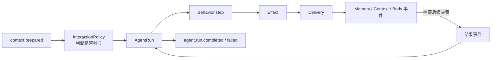

# Agent 开发文档

Agent 是 SenaBot 中决定“接下来做什么”的一层。它接收 Context 整理好的对话内容，先判断 Sena 是否需要参与，再选择合适的 Behavior 推进这次任务，直到任务结束或需要等待其他模块返回结果。

## 为什么使用 Agent

生成一条回复并不只是调用一次模型。Agent 可能先查询记忆，再组织提示词、生成回复、记录 Context，最后把内容交给 Body。如果把这些步骤直接串成模块调用，流程越长，各模块之间的依赖就越难拆开。

因此，Agent 用 `AgentRun` 记录一次任务的进度。Behavior 根据当前状态和刚收到的结果决定下一步，并用 Effect 表达要执行的动作。Dispatcher 找到相应的 Delivery，把动作转换成跨模块事件。需要参与后续决策的结果会通过关联 ID 找回对应的 Run；回复交给 Context 和 Body 后，本次 Run 就可以结束。

## Agent 的边界

Agent 管理交互参与判断、Behavior 选择、Run 生命周期、外部操作关联和 Effect 分发。它会组织 Persona 和模型输入，但不保存会话历史，不执行记忆读写，也不直接向具体平台发送消息。

Context、Memory 和 Body 仍拥有各自的数据与业务规则。Agent 只依赖它们的事件契约，不直接调用其他模块的 Runtime、Manager 或 Repository。

开发 Agent 或接入其他模块时，需要保持几条边界：

- Behavior 只返回新状态和 Effect，不直接发布跨模块事件；
- Runtime 只管理 Run，不解释 `behavior_state` 的业务含义；
- Delivery 只负责把一种 Effect 转换为公开事件；
- 同一个 Run 当前最多等待一个外部操作；
- 需要继续决策的外部操作使用 `operation_id` 恢复 Run；
- Reply Effect 发布 Context 和 Body 请求后，由同一步的 Finish Effect 结束 Run；
- `agent.run.completed` 表示 Agent 已完成本次行为，Body 交付状态通过 Body 自己的结果事件观察。

## 文档导航

- [公开 API](public-api.md)：Agent 事件、公开结构和终态语义。
- [Module 接入指南](integration-guide.md)：Context、Memory、Body 和观察模块如何接入。
- [Agent 核心开发指南](../../../src/core/agent/README.md)：Runtime、Behavior、Dispatcher 和 Delivery 的内部关系。

## 当前范围

目前只有 Conversation Behavior。Run 状态保存在进程内，而且一次只能等待一个外部结果；任务恢复、Run 持久化、并行外部操作和面向插件的稳定 Behavior 接口还没有实现。
