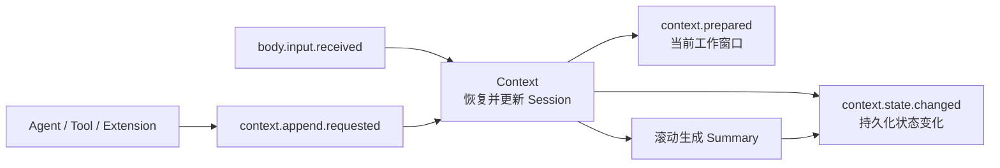

# Context 开发文档

Context 是 SenaBot 的会话上下文层。它把同一段对话或同一个任务产生的记录放在一起，保持这些记录的先后顺序，并向 Agent 提供当前需要的上下文。

## 为什么使用 Context

Agent 处理一条新消息时，通常还需要看到这段对话之前的内容。若 Body、Agent 和 Data 各自判断消息属于哪段对话、应该读取哪些历史，很容易出现身份不一致或记录顺序混乱。

Context 为每段持续对话或独立任务建立一个 Session。写入其中的单条记录称为 Entry；当记录逐渐变多，较早的 Entry 会被整理成 Summary。近期 Entry 和已有 Summary 共同组成当前工作窗口，Agent 不需要每次加载完整历史。

程序启动后，某个 Session 第一次收到输入时，Context 会先通过事件询问持久化模块是否保存过旧状态。恢复或初始化完成后，本次输入才会写入并产生 `context.prepared`。后续访问直接使用已经加载的状态。

## Context 的边界

Context 负责 Session 身份、Entry 顺序、状态恢复、工作窗口和滚动摘要。它不理解正文的业务含义，也不决定 Agent 如何回复。

平台消息归一化和输出路由由 Body 处理，实际的数据读写由 Data 处理。Context 只通过 Event 与这些 Module 协作，不直接调用它们的 Runtime、Manager 或 Repository。

开发时遵守以下规则：

- 使用 Context 返回的 `session_id`，不自行生成或解析；
- 通过事件读取或更新 Context，不直接操作内部 Store；
- 发布事件后不等待业务返回值，通过后续事件继续流程；
- Entry、Summary 和从持久化模块恢复的完整状态不能跨 Session 使用。

## 文档导航

- [公开 API](public-api.md)：公开事件、结构、字段和状态约束。
- [Module 接入指南](integration-guide.md)：Agent、任务模块和持久化模块如何接入。
- [Context 核心开发指南](../../../src/core/context/README.md)：内部结构、恢复流程和压缩规则。

## 当前范围

当前实现使用进程内状态，持久化由外部 Module 根据事件完成。摘要器可以不配置，但此时生成的 Summary 没有语义文本。历史逐层读取已经定义契约，尚未实现 Handler。
