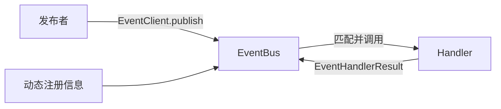

# Event 开发文档

Event 是 SenaBot 的进程内跨 Module 通信层。发布者只描述“发生了什么”，处理者通过动态注册声明“我能处理什么”，双方不直接依赖彼此的 Runtime、Manager 或 Repository。

## 为什么使用 Event

如果 Module 直接调用另一个 Module：

```python
await memory_runtime.query(...)
```

调用方会依赖对方的实现和生命周期。改为事件后：

```python
return EventHandlerResult(
    derived_events=[events.derived("memory.query.requested", request)]
)
```

EventBus 只根据注册信息匹配 Handler，不认识 Memory、Body、Agent 等具体业务。因此新增 Module、事件或 Handler 不需要修改 Event 核心。



## Event 的边界

Event 负责信封校验、动态匹配、分发、超时与异常隔离、追踪、结果汇总和派生事件。

Event 不解释 Payload，不判断 Session 或业务权限，不执行数据库操作，也不维护固定业务路由。业务校验和处理仍由事件所属 Module 完成。

跨 Module 通信应遵守：

- Module 只调用自己的 Runtime；
- 跨 Module 操作通过事件表达；
- 事件定义和 Handler 在启动时动态注册；
- 业务代码只从 `core.event` 导入公开对象；
- 调用方使用绑定 owner 的 API，不自行伪造 source；
- Module 或扩展停止时按 owner 注销。

## 从哪里开始

- [公开 API](public-api.md)：契约、接口、分发规则和错误处理。
- [Module 接入指南](integration-guide.md)：从定义 Payload 到注册、发布和注销的完整示例。

修改 `core.event` 本身时，阅读源码目录中的 [Event 核心开发指南](../../../src/core/event/README.md)。

## 当前范围

当前实现是进程内、内存注册、顺序等待 Handler 的 MVP，暂不提供消息持久化、自动重试、跨进程 Transport、并发注册事务或第三方插件权限门面。

