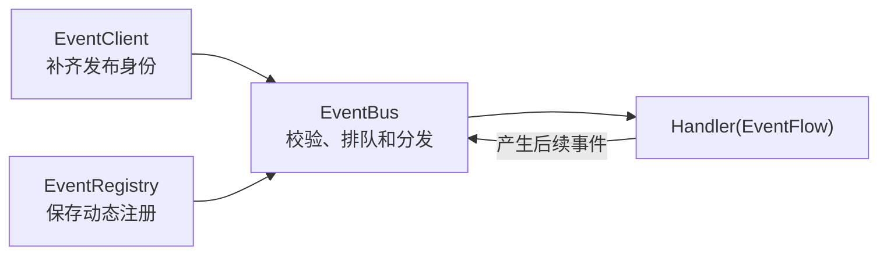

# Event 开发文档

Event 是 SenaBot 的进程内跨 Module 通信层。发布者只说明“发生了什么”，Handler 通过动态注册声明“我处理什么”，双方不直接依赖彼此的 Runtime、Manager 或 Repository。

## 为什么使用 Event

直接调用其他 Module 会把调用方与对方的实现和生命周期绑定在一起：

```python
await memory_runtime.query(request)
```

跨 Module 操作改用事件后，当前 Module 只依赖公开的事件契约：

```python
flow.emit("memory.query.requested", request)
```

EventBus 根据运行时注册信息寻找 Handler，不认识 Body、Context、Agent、Memory 等业务模块。因此，增加业务事件或 Handler 不需要修改 Event 核心。



一次事件的过程是：Client 构造信封，Bus 校验并入队，Registry 提供匹配的 Handler，Handler 处理自己的业务，并可通过 Flow 产生后续事件。

## Event 的边界

Event 只负责信封校验、动态注册与匹配、异步分发、基础超时与异常隔离、事件追踪以及派生事件。

Event 不解释 Payload 或执行任意的业务逻辑

开发时遵守以下规则：

- Handler 只调用自己 Module 的模块；
- 跨 Module 操作通过事件表达；
- 业务代码只从 `core.event` 导入公开对象；
- 使用绑定 owner 的 Client 发布；
- Module 卸载时注销它拥有的事件定义和 Handler。

## 文档导航

- [公开 API](public-api.md)：公开类型、字段、方法和分发行为。
- [Module 接入指南](integration-guide.md)：完成一个 Module 的注册、发布和卸载。
- [Event 核心开发指南](../../../src/core/event/README.md)：修改 Event 内部实现时需要理解的结构和不变量。

## 当前范围

当前实现使用单进程内存队列和内存注册表，不提供持久化、自动重试、跨进程消息传输或第三方插件权限隔离。
