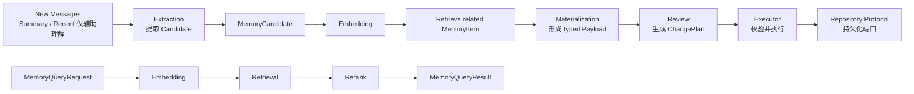

# Memory 开发文档

Memory 是 SenaBot 的长期信息层，负责从输入中提取候选信息、形成受领域规则约束的正式记忆，并在后续交互中召回相关记忆。

Memory 不把一段自然语言直接写入存储。它先区分候选、领域内容和正式记忆，再通过 Review 决定新增、结束事实有效期、替代旧版本或不做变更。

## 为什么使用 Memory

对话历史只能描述近期上下文，无法稳定表达长期事实、共同经历、逐步形成的理解和可复用知识。Memory 将这些信息统一表示为 `MemoryItem`：

```text
MemoryItem
├── item_id
├── memory_space_id
├── scopes
└── payload
    ├── Fact
    ├── Experience
    ├── Understanding
    └── Knowledge
```

`MemoryPayload` 表达“记忆内容是什么”，`MemoryItem` 表达“这是哪一条正式记忆、属于哪个长期主体”，两者不承担一次写入操作的上下文；`operation_id` 位于外层 `MemoryWriteEnvelope`。

## 架构概览



### Extraction

```text
new messages + summary + recent messages
        ↓
MemoryService.extract()
        ↓
list[MemoryCandidate]
```

Extraction 只从 `new messages` 提取候选；summary 和 recent messages 只帮助消歧，不能被重新提取为本轮新记忆。Assistant 的推测、建议和未经用户确认的信息不能作为用户事实。每个 Candidate 拥有独立 `candidate_id`，携带可信 provenance，并通过 `source_message_ids` 引用支持它的本轮新消息。

### Formation

```text
MemoryCandidate
        ↓
embedding → retrieve related MemoryItem
        ↓
materialize MemoryPayload
        ↓
review MemoryChangePlan
        ↓
execute Add / EndFactValidity / Supersede / NoChange
        ↓
MemoryRepositoryProtocol
```

Formation 使用同一份 `related_items` 快照完成 Materialization、Review 和 Execution 校验，避免一次形成过程中引用不同版本的旧记忆。

### Recall

```text
MemoryQueryRequest
        ↓
embedding
        ↓
retrieve with MemoryRecallContext
        ↓
rerank
        ↓
MemoryQueryResult[list[MemoryItem]]
```

`MemoryScopeRef` 是长期主体归属，不是未来使用场景的发布白名单。Recall 只负责提供当前请求可考虑的记忆；Agent 是否发言、如何表达以及能否披露敏感信息不属于 Memory。

## Memory 的边界

Memory 负责：

- 候选长期信息提取；
- `Fact`、`Experience`、`Understanding`、`Knowledge` 的领域建模；
- 基于 Scope 的粗粒度召回边界；
- 相关旧记忆召回、领域成形和变更审查；
- ChangePlan 校验和持久化端口调用。

Memory 不负责：

- 生成或持久化 Context summary、recent messages；
- 决定 Agent 是否在当前群聊发言；
- 决定最终措辞、人格表现或敏感信息披露；
- 提前计算普通个人记忆未来可在哪些具体群聊使用；
- 实现当前尚不存在的正式 Data 层、向量数据库或事务；
- 仅凭 `operation_id` 承诺完整幂等。

## 公开事件

Memory 当前已经提供 Event 接入入口。组合根安装 `MemoryModule` 后，其他模块通过事件请求查询或写入：

```text
memory.query.requested
    -> MemoryService.query()
    -> memory.query.completed / memory.query.failed

memory.write.requested
    -> MemoryService.write()
    -> memory.write.completed / memory.write.failed
```

事件 Handler 只做边界适配。Extraction、Formation、Review、Execute 仍然是 Memory 内部流程，不作为跨模块事件暴露。

## 文档导航

- [公开 API](public-api.md)：Service 方法、事件 Payload、输入输出结构、依赖协议和失败行为。
- [领域模型](domain-model.md)：四类 Payload、Scope、生命周期和 ChangePlan 约束。
- [接入指南](integration-guide.md)：装配依赖并调用 Query、Write、Extraction、Formation 和 Event 接口。

Memory 内部维护指南见 `src/core/memory/README.md`；外部 Module 不应依赖 LLM Prompt、JSON 解析器、Converter 私有函数或 Executor 私有方法。

## 当前范围

当前已经完成 Extraction、Formation、Recall、Write 编排和 Event 接入的基础链路，但仍处于 MVP 基础设施阶段：

- `MemoryRepositoryProtocol` 只有接口，没有正式 Data 层实现；
- `SimpleMemoryEmbedder`、`SimpleMemoryRetriever`、`SimpleMemoryReranker` 是测试/MVP 占位实现；
- Simple Retriever 只在内存快照上进行 Scope 过滤，不使用 embedding 计算语义相关性；
- 写入事务、失败恢复、operation ledger 和完整幂等语义尚未实现；
- `persona_id / bot_id -> memory_space_id` 的跨模块映射责任仍需确认。

运行 Memory 测试：

```bash
pytest tests/memory -q
```
