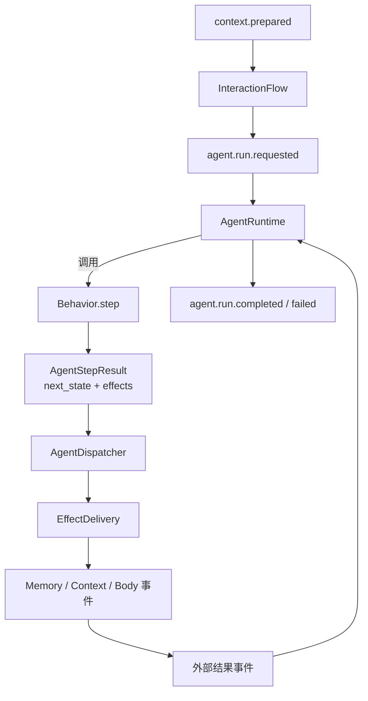

# Agent 核心开发指南

本文面向维护 `core.agent` 的开发者，帮助开发者快速建立源码模型，理解 Context 输入如何变成 AgentRun、Behavior 如何推进 Run，以及外部结果返回后如何继续。其他 Module 的接入方式见[外部开发文档](../../../docs/modules/agent/README.md)。

## 1. 架构概览

Agent 把一次任务拆成几个相对独立的部分：Behavior 决定下一步，Runtime 保存执行进度，Dispatcher 检查这一步是否可以执行，Delivery 再把其中的外部动作转换成事件。这样，行为逻辑不需要知道 Event 如何发布，Runtime 也不用理解对话或记忆。



普通对话从 `context.prepared` 开始。`InteractionPolicy` 先判断 Sena 是否应该参与，`InteractionFlow` 再创建 Conversation Run。这个 Behavior 首先请求记忆，拿到结果后组织模型输入并生成回复。ReplyDelivery 随后请求 Context 记录回复、Body 发送回复；Body 报告交付结果后，这次 Run 才真正结束。

第一次阅读源码时，可以先看 `contracts.py` 和 `runtime.py`，理解 Run 怎样推进；然后看 `dispatcher.py` 与 `deliveries/`，了解 Effect 如何变成事件。最后再从 `interaction_flow.py`、`behaviors/conversation.py` 一路读到 `run_flow.py` 和 `events.py`，完整流程会更容易对应起来。

## 2. 边界和文件职责

Agent 的工作是行为决策和执行协调。Context 的保存、Memory 的实际读写以及平台 Adapter 的调用都不在这里完成。

| 文件 | 职责 |
|---|---|
| `contracts.py` | Run、Observation、Effect、Step 和事件 Payload |
| `state.py` | 当前 Behavior 使用的纯数据状态 |
| `runtime.py` | Run 创建、step、等待、恢复和终止 |
| `dispatcher.py` | 校验 Effect，维护等待关系并调用 Delivery |
| `deliveries/` | 把 Effect 转换成跨模块事件 |
| `interaction.py` | 是否参与当前输入的确定性规则 |
| `interaction_flow.py` | Context 输入到 Run 请求的转换 |
| `behaviors/` | 具体行为决策 |
| `persona.py`、`prompts/` | Persona Prompt 和模型调用入口 |
| `run_flow.py` | 事件结果与 Runtime 迁移之间的适配 |
| `events.py` | Agent 事件定义、订阅和内部对象装配入口 |
| `__init__.py` | `core.agent` 的公开导出 |

修改代码时，下面几条边界比具体文件划分更重要：

- Runtime 不导入 Context、Memory、Body 或具体 Behavior；
- Behavior 不直接访问 Runtime 或 EventBus；
- Dispatcher 不解释业务 Payload；
- Delivery 不修改 Behavior 状态；
- 跨模块工作只能通过事件完成；
- 组合根负责选择 Behavior 和 Delivery 实现。

## 3. Run 的运行模型

`AgentRun` 保存一项任务继续执行所需的信息：Run ID、可选的 Session ID、Behavior 类型、Behavior 自己的状态、当前等待的操作和已经执行的 step 数。

```text
创建 Run
  -> 执行 STARTED step
  -> 等待外部结果 / 继续结束
  -> 用 EXTERNAL_RESULT 恢复
  -> 再次 step 或直接完成
  -> completed / failed
```

Runtime 内部维护两个索引：

```text
_runs:             run_id -> AgentRun
_operation_to_run: operation_id -> run_id
```

调用 `start()` 时，Runtime 会先检查 Run ID、Behavior 类型和初始状态。检查通过后才创建 Run，并以 `STARTED` Observation 调用第一次 `step()`。Behavior 返回后，Runtime 保存 `next_state`，更新 `step_count`，再把这次变化包装成 `AgentTransition`。

需要等待外部结果时，Dispatcher 通过 `wait_for()` 记录关联关系。结果到达后，`resume()` 会同时核对两个索引以及 Run 上的 `PendingOperation`。只有三处信息一致，结果才会被消费；未知、过期或重复结果只会得到 `None`，不会再次触发 Behavior。

结束有两条路径：

- `complete()` 表示流程按 Behavior 的控制语义走到终点；
- `fail()` 表示 Runtime、Behavior 或 Effect 无法继续。

无论以哪种方式结束，Runtime 都会先清理 Run 和对应的 operation 索引，再返回终态 Transition。终态事件发出时，这个 Run 已经不在 Runtime 中。

### step 上限

`max_steps` 防止 Behavior 意外地无限运行，默认值是 32。Runtime 会在每次调用 Behavior 之前检查计数，达到上限后以 `step_limit_exceeded` 结束 Run。

step 次数不是模型调用次数。一个 Behavior step 可以不调用模型，也可以产生一个需要等待的外部操作。

### 纯数据状态

`behavior_state` 完全由 Behavior 定义，Runtime 只要求它由可以保存的数据组成。目前允许基础值、枚举、日期时间、dataclass、Mapping 和非字节 Sequence 的递归组合。

函数、协程、生成器、文件句柄和循环引用都会被拒绝。这里并不保证状态一定能直接序列化成 JSON，主要是避免把 Runtime、Client 一类带生命周期的对象放进 Run。

## 4. Behavior、Observation 和 State

Behavior 只有一个入口：

```python
async def step(
    state: object,
    observation: AgentObservation,
) -> AgentStepResult:
    ...
```

新 Run 第一次执行时收到 `STARTED`；先前等待的操作有结果时收到 `EXTERNAL_RESULT`。外部结果的 Payload 由具体 Behavior 识别，Runtime 只负责原样传递。

Behavior 每次都返回下一份纯数据状态和一个 Effect 元组。不可变状态可以直接复用，也可以通过 `dataclasses.replace()` 生成新状态；不要把 Runtime 或全局事件状态藏进其中。

目前的 `ConversationState` 只保存 Conversation Behavior 需要的 Context 工作窗口、本轮用户文本和已取得的记忆。新的 Behavior 应该拥有自己的 State，不要为了省一个类型而不断给 `ConversationState` 增加可选字段。

### 新增 Behavior

实现新的 Behavior 时，通常需要完成这些工作：

1. 定义稳定的开放字符串 `behavior_type`；
2. 为它建立独立纯数据 State；
3. 实现 `step(state, observation)`；
4. 明确每种 Observation Payload；
5. 只返回已经安装 Delivery 的 Effect；
6. 在组合根的 Behavior 映射中注册；
7. 增加启动、恢复、失败和终止测试。

Runtime 已经通过映射查找 Behavior，因此新增类型不需要在其中加入 `if behavior_type == ...`。如果一项改动必须让 Runtime 理解某个具体行为，通常说明职责放错了位置。

## 5. Effect 和 Dispatcher

Effect 是 Behavior 表达意图的方式。它只描述“要做什么”，并不包含事件发布过程。目前有以下几种：

| Effect | 含义 | 是否等待结果 |
|---|---|---|
| `MemoryQueryEffect` | 查询当前范围可访问的记忆 | 是 |
| `MemoryWriteEffect` | 请求写入长期记忆 | 是 |
| `ReplyEffect` | 记录并交付角色回复 | 是，由 Delivery 生成输出 ID |
| `FinishEffect` | 当前 Run 完成 | 否 |
| `FailEffect` | 当前 Run 失败 | 否 |

Dispatcher 不会拿到一个 Effect 就立刻执行，而是先检查整个 step，形成完整的执行计划：

1. 如果存在 FailEffect，使用第一个失败并终止 Run；
2. FinishEffect 最多一个；
3. 每个外部 Effect 必须存在精确类型匹配的 Delivery；
4. 一个 step 最多产生一个需要等待的 operation ID；
5. 没有等待操作时必须有 FinishEffect，否则认为 Run 停滞。

`FinishEffect` 可以和一个需要等待的 Effect 同时出现。这意味着“动作完成后就结束”，Dispatcher 会记录 `finish_after_result=True`。结果回来后 Runtime 直接收尾，不再调用 Behavior；Conversation 的回复交付正是这种情况。

等待关系必须先登记，再由 Delivery 发布事件。顺序反过来时，如果外部 Handler 很快返回，结果可能早于 operation 索引到达，之后就无法恢复对应的 Run。

### 失败边界

如果执行计划本身不合法，Dispatcher 会通过 Runtime 终止 Run，并发布 `agent.run.failed`。Delivery 执行时抛出的异常则不会在这里转换成 Agent 失败，而是交给 Event Handler 的错误隔离机制处理。

这里有一个需要特别留意的边界：EventFlow 可以丢弃尚未提交的派生事件，却不能回滚 Runtime 已经登记的等待关系。因此 Delivery 应在 `emit()` 之前完成能够预先完成的校验，构造事件的过程也应保持无副作用。

## 6. Delivery

Delivery 是 Effect 与公开事件之间的适配器，接口很小：

```python
class EffectDelivery(Protocol[EffectT]):
    def pending_operation_id(self, effect: EffectT) -> str | None: ...

    def emit(
        self,
        flow: EventFlow,
        effect: EffectT,
        operation_id: str | None,
    ) -> None: ...
```

Dispatcher 在计划阶段调用 `pending_operation_id()`，所以这个方法不能发布事件或修改状态。返回 `None` 表示动作不需要等待；返回字符串时，Dispatcher 会先用它建立等待关系。

`MemoryDelivery` 直接使用 Effect 自带的 operation ID，把请求转换成 Memory 查询或写入事件。`ReplyDelivery` 则在计划阶段生成输出 ID，随后发布两个事件：

- `context.append.requested`，把 Sena 回复记入对应 Session；
- `body.output.requested`，把回复交给 Body。

这些类只做字段映射。是否查询记忆、回复什么内容、是否应该形成长期记忆，都不应由 Delivery 决定。

### 新增 Delivery

增加一种外部 Effect 时，还要把下面几处连起来：

1. 定义语义明确的 Effect；
2. 实现 `pending_operation_id()` 和 `emit()`；
3. 在 Dispatcher 的 Delivery 映射中注册 Effect 类型；
4. 如果需要等待，确定哪个结果事件携带相同 ID；
5. 在 RunFlow 中把结果转换成 EXTERNAL_RESULT；
6. 测试字段映射、重复结果和终态行为。

## 7. Interaction 与 Conversation

`InteractionPolicy` 只根据已经归一化的输入信号做判断，不访问外部资源。机器人输入会被忽略；私聊和桌面输入直接参与；群组与频道只有在消息明确指向 Sena 时才参与。

`InteractionFlow` 在收到 `context.prepared` 后调用这项策略。不参与时发布 `agent.interaction.ignored`；参与时找到 `trigger_entry_id` 对应的 Entry，用它创建 `ConversationState`，再发布内部的 `agent.run.requested`。

ConversationBehavior 当前有两步：

```text
STARTED
  -> MemoryQueryEffect

Memory 查询结果
  -> 合并授权记忆
  -> 组织 Context Entry、Summary 和 Persona Prompt
  -> 调用模型
  -> ReplyEffect + FinishEffect
```

送入模型的消息依次由历史摘要、已取得的记忆和近期 Entry 组成。Entry 会按类型变成 user、assistant 或 system 消息。ConversationBehavior 使用 Context 已经准备好的窗口，不会再去读取 Context Store 或自行加载更早的历史。

`PersonaResponder` 统一加入角色系统提示。它先调用主 Provider，出现异常时再尝试备用 Provider。Behavior 只准备本次任务的消息，不需要重复拼接 Persona 内容。

## 8. RunFlow 和事件装配

`RunFlow` 连接事件 Handler 和 Runtime，本身不处理行为逻辑：

- `agent.run.requested` 调用 `runtime.start()`；
- Memory 查询和写入完成事件按关联 ID 调用 `runtime.resume()`；
- Body 的完成、部分完成和失败事件按输出 ID 恢复 Run；
- 每个非空 Transition 交给 Dispatcher。

`AgentModule` 集中注册 Agent 拥有的事件，以及 Context、Memory 和 Body 结果事件的 Handler。Runtime、Behavior 和 Delivery 仍由组合根创建，再注入 AgentModule。

终态事件有两类：

- `agent.run.completed`：Run 按控制流程结束，`outcome` 保存外部结果；
- `agent.run.failed`：Agent 自身无法继续，携带稳定错误码。

Body 输出失败不应自动变成 `agent.run.failed`：前者是一次外部动作的结果，后者说明 Agent 自己已经无法继续运行。

## 9. 并发和关联 ID

AgentRuntime 目前使用进程内字典保存状态，没有额外加锁，也不能跨进程共享。它假定同一个 Runtime 只由一个 asyncio 事件循环驱动。

不同 Run 可以同时推进；同一个 Run 则通过唯一的 PendingOperation 串行等待。operation ID 在一个 Runtime 内必须唯一，冲突时 `wait_for()` 会抛出错误。

结果事件可能重复，也可能延迟到达，甚至根本不属于这个 Runtime。遇到未知 ID 时，`resume()` 返回 `None`，RunFlow 到此为止；已经消费过的结果也不会让 Behavior 再执行一次。

Run ID 冲突会产生结构化失败，不会覆盖已有 Run。系统目前也没有按 Session 串行化，同一 Session 可以同时存在多个 Run，因此不能假设它们一定按输入顺序完成。

## 10. 组合根

Agent 没有隐藏的全局注册。应用启动时，组合根需要完成以下装配：

1. 创建模型 Provider 和 PersonaResponder；
2. 创建并映射 Behavior；
3. 创建 AgentRuntime；
4. 创建 Delivery 并映射 Effect 类型；
5. 创建 AgentDispatcher、InteractionPolicy 和 AgentModule；
6. 使用 owner 为 `agent` 的 ModuleEventAPI 注册事件。

Runtime、Dispatcher 和 AgentModule 必须引用同一个 Runtime 实例。Behavior 和 Delivery 都通过显式映射安装，启动代码因此可以直接看出当前启用了哪些能力。

组合示例见[接入指南](../../../docs/modules/agent/integration-guide.md)。

## 11. 测试与排错

Agent 测试位于 `tests/agent`：

```powershell
$env:PYTHONPATH = "src"
python -m unittest discover -s tests/agent -p "test_*.py" -v
```

测试重点放在状态推进和模块边界上：

- Runtime 启动、等待、恢复、终止、异常和 step 上限；
- Dispatcher 对 Finish、Fail、缺失 Delivery 和多个等待的处理；
- Delivery 的字段映射和事件类型；
- InteractionPolicy 的场景规则；
- Conversation 的 Memory 请求、结果恢复和回复 Effect；
- RunFlow 将事件结果交给正确 Run；
- 未知或重复 operation ID 不会重复执行。

排查问题时，沿事件链往后看通常最快：Context 是否发布 prepared → Interaction 是否选择参与 → Run 是否创建 → Behavior 返回了哪些 Effect → 是否安装对应 Delivery → operation ID 是否登记 → 结果事件是否带回同一个 ID → Run 是否产生终态。

## 12. 当前限制和提交检查

目前还没有覆盖这些能力：

- 只有 Conversation Behavior；
- Run 和 operation 索引只存在于进程内；
- 一个 Run 同时只能等待一个外部操作；
- 没有 Run 超时、取消、持久化或重启恢复；
- Memory 失败事件尚未接入 Run 恢复；
- 外置插件使用的 Behavior/Effect API 尚未形成稳定公开面。

提交前确认：

- [ ] Runtime 没有具体 Behavior 或业务 Module 分支；
- [ ] Behavior 只返回 State 和 Effect；
- [ ] 新 Effect 已安装 Delivery 和结果恢复路径；
- [ ] 一个 Run 不会同时登记多个等待操作；
- [ ] 等待关系在请求事件发布前建立；
- [ ] 终止时 Run 和 operation 索引都被清理；
- [ ] 未知或重复结果不会重复推进 Run；
- [ ] 外部动作结果与 Agent 内部失败没有混用；
- [ ] 新公开事件、结构和错误码已同步到文档和测试。
