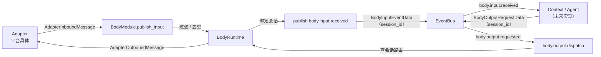

# Body 模块开发指南

本文面向维护 `core.body` 的开发者，帮助快速建立源码模型，并明确修改时不能破坏的行为。通用的事件接线方式见[外部开发文档](../../../docs/modules/event/README.md)和[接入指南](../../../docs/modules/event/integration-guide.md)。

## 1. 架构概览

Body 是平台无关的会话边界：负责平台输入归一化、去重、会话绑定与输出 Adapter 路由。它不包含对话、记忆或权限策略。



主要对象之间的关系：

- `AdapterInboundMessage` / `AdapterOutboundMessage` 是 Adapter 侧的私有消息，平台具体，原始 SDK 对象不得越过此边界；
- `BodyInputEventData` / `BodyOutputRequestData` 是公共契约，平台无关，`session_id` 是唯一寻址句柄；
- `BodyRuntime` 负责输入过滤、去重、会话绑定、输出路由与幂等；
- `SessionRoute` 是 Body 内部维护的 `session_id → 具体平台路由` 映射；
- `AdapterRegistry` / `BodyAdapter` 定义 Adapter 的注册与发送协议；
- `events.py` 是 Body 到 EventBus 的适配，只调用本模块 Runtime。

运行时调用链是：Adapter 入站 → `BodyModule.publish_input` → Runtime 过滤/去重/绑定会话 → 发布 `body.input.received` → Context/Agent 消费 → 发布 `body.output.requested` → `BodyModule._handle_output` 查会话路由 → Adapter 发送 → 按结果发布完成/失败事件。

推荐阅读顺序：`common.py`、`contracts.py` → `ports.py` → `runtime.py` → `events.py`。后续章节也按这个顺序解释源码。

## 2. 边界和文件职责

Body 只处理"平台输入 → 规范输入"和"规范输出 → 平台发送"：归一化、去重、会话绑定、路由、幂等与结果事件。Body 不得导入对话、记忆或权限模块，不解释业务 Payload。

| 文件 | 职责 |
|---|---|
| `common.py` | `ErrorInfo`、`OperationStatus`、`UserRole`（`core/common` 落地后可整体迁移） |
| `contracts.py` | 公共契约与 Adapter 侧消息、内容与场景模型 |
| `ports.py` | `BodyAdapter` 协议与 `AdapterRegistry` |
| `runtime.py` | 过滤、去重、会话绑定、输出路由、幂等与错误映射 |
| `events.py` | `BodyModule` 与 EventBus 接入：注册、订阅和入站发布入口 |
| `factory.py` | 创建 `AdapterRegistry`、`BodyRuntime` 并返回完整 `BodyModule` |
| `__init__.py` | `core.body` 的公开导出 |

必须保持的不变量：

- 公共契约（`BodyInputEventData` / `BodyOutputRequestData`）不暴露平台标识，`session_id` 是唯一寻址句柄；
- 原始 SDK 对象不得越过 `AdapterInboundMessage` / `AdapterOutboundMessage` 边界；
- 同一 `(adapter_type, platform, scene_type, scene_id)` 复用同一个 `session_id`；
- 路由只由 BodyRuntime 内部解析，Event 核心不解释业务 Payload；
- Adapter 异常必须映射为稳定结果事件，不能穿透到 EventBus；
- 同一 `output_id` 幂等返回缓存结果；
- Body 不承担对话或权限策略。

## 3. 数据模型

Body 有两组对称的契约：Adapter 侧平台具体，公共侧平台无关。

| 方向 | Adapter 侧（平台具体） | 公共侧（平台无关） |
|---|---|---|
| 输入 | `AdapterInboundMessage` | `BodyInputEventData` |
| 输出 | `AdapterOutboundMessage` | `BodyOutputRequestData` |

公共字段语义：

- `session_id`：Body 内部维护的不透明会话句柄（UUID）。重启后可能失效，被动输入会自动重新绑定；
- `scene`：仅供语义判断（私聊/群聊/哪个群），不用于寻址；`scene_id` 是平台作用域的，与 `adapter_type`/`platform` 组合才全局唯一；
- `source.user_id`：身份判定使用规范化 ID（优先 `principal_id`）。`platform_user_id` 是平台作用域字段，公共契约只承诺 `user_id`；
- `metadata`：展示/附加元数据（如 `presentation.emotion/state`），由 Body 浅拷贝后透传给 Adapter；
- 输出没有 `reply_token`：默认回复该会话最近一条入站消息（`SessionRoute.last_input_message_id`），`None` 表示普通发送。

`Content` 是统一内容模型：`text` 为纯文本摘要（可由 `segments` 补全），`segments` 支持多类型片段，`text_value()` 返回去除首尾空白的文本，用于空输入过滤。

## 4. 会话路由

`SessionRoute` 记录会话对应的具体平台路由：

```text
adapter_type            注册键
platform                注册键
scene                   平台作用域场景
last_input_message_id   最近一条入站消息的平台 ID，作为默认回复目标
```

`BodyRuntime` 维护四张内部表：

| 表 | 键 → 值 | 容量 |
|---|---|---|
| `_seen_input_keys` | `(adapter_type, platform, message_id)` → `None` | 有界（`_MAX_TRACKED`） |
| `_sessions` | `session_id` → `SessionRoute` | 无界（未持久化） |
| `_session_ids` | `(adapter_type, platform, scene_type, scene_id)` → `session_id` | 无界（未持久化） |
| `_output_result_cache` | `output_id` → 最近一次发送结果 | 有界（`_MAX_TRACKED`） |

入站绑定流程：空输入过滤 → 平台消息 ID 去重 → `_normalize` 解析角色 → `_bind_session` 按路由键查/建会话 → 生成 `BodyInputEventData`。

主动会话：`open_session(adapter_type, platform, scene)` 先校验 Adapter 已注册，再创建或复用会话，返回不透明 `session_id`。主动会话与同一路由的入站会话共享同一 ID。

输出流程：`handle_output_request` 先查 `output_id` 幂等缓存，再 `_dispatch`：`session_id` → `_sessions` 查路由 → `AdapterRegistry.get` 取 Adapter → 组装 `AdapterOutboundMessage`（metadata 浅拷贝）→ `adapter.send()`。

错误码：

| 错误码 | 触发条件 |
|---|---|
| `session_not_found` | `session_id` 未绑定、已失效或来自未知来源 |
| `adapter_not_found` | 会话路由有效，但对应 Adapter 未注册 |
| `adapter_send_failed` | Adapter 发送异常或没有任何项发送成功 |

## 5. 事件接入

| 事件 | Payload | 方向 |
|---|---|---|
| `body.input.received` | `BodyInputEventData` | Adapter 入口 → Context/Agent |
| `body.output.requested` | `BodyOutputRequestData` | Context/Agent → Body |
| `body.output.completed` / `partially_completed` / `failed` | `BodyOutputResultEventData` | Body → 订阅者 |

接线方式：

- `BodyModule.register(events)` 声明 Body 拥有的事件，并订阅 `body.output.requested`；
- `BodyModule._handle_output(flow)` 执行 `runtime.handle_output_request(flow.payload)`，再发布对应结果事件；
- `BodyModule.publish_input(events, message)` 是唯一入站入口，被过滤时返回 `None`，否则发布输入事件并返回 Payload。

前置条件：

- `EventBus` 必须先 `start()` 才能发布事件，关闭时按 `stop()` 排空队列；
- 事件类型发布前必须已经注册，否则会校验失败；
- 派生事件继承父事件的 trace 与 metadata。

信任边界：当前 EventBus 不做发布权限校验，任何持有 `EventClient` 的模块都能发布 `body.output.requested`，Body 会真实发送到平台。第三方插件需要宿主提供受限门面。

## 6. Adapter 接入

实现 `BodyAdapter` 协议（`adapter_type`、`platform`、`async send(outbound)`）并注册到 `AdapterRegistry`；同一 `(adapter_type, platform)` 重复注册以最后一次为准，运行期不提供动态更换入口。

入站：Adapter 构造 `AdapterInboundMessage`（`user_id` 必须是已解析的规范身份），调用组合根注入的 `BodyModule.publish_input`。

出站：`send(outbound)` 接收平台具体的 `AdapterOutboundMessage`，返回 `list[BodyOutputItemResult]`；异常由 BodyRuntime 映射为稳定失败结果。

## 7. 组合根接线示例

```python
bus = EventBus()
body = create_body_module(owner_user_id="owner")
body.register(ModuleEventAPI(bus, "body"))
body.register_adapter(DiscordAdapter())

await bus.start()

# Adapter 入站入口由组合根绑定给具体 Adapter。
await body.publish_input(adapter_client, inbound_message)
```

## 8. 修改指引

| 修改目标 | 主要文件 | 必须同时考虑 |
|---|---|---|
| 修改公共契约 | `contracts.py`、`__init__.py` | 平台无关性、测试与外部文档 |
| 修改会话/路由 | `runtime.py` | 索引一致性、幂等与错误码 |
| 修改事件名或 Payload | `events.py`、`contracts.py` | 注册、订阅与派生事件 |
| 修改 Adapter 协议 | `ports.py`、`contracts.py` | 出站消息字段与结果结构 |
| 修改本地通用类型 | `common.py` | `core/common` 落地后的迁移路径 |

## 9. 测试和排错

测试位于 `tests/body/test_body_runtime.py`，至少覆盖：

- 空输入过滤、平台消息 ID 去重；
- 会话绑定、同会话复用、不同场景隔离、角色解析；
- 公共契约不暴露平台标识；
- 输出路由、幂等、`session_not_found` / `adapter_not_found` / `adapter_send_failed`；
- metadata 浅拷贝、`open_session` 主动发送与复用；
- `body.input.received` 与 `body.output.*` 的 EventBus 往返。

排错按运行顺序检查：EventBus 状态 → 输入去重 → 会话绑定（路由键是否一致）→ `_dispatch` 路由解析 → Adapter 是否注册 → Adapter 发送结果 → 结果事件。

## 10. 当前限制和提交检查

当前没有会话持久化与容量上限、没有显式回复更早消息的 token、`core/common` 未落地（body 自带本地类型）、EventBus 无发布权限校验；多 body、真实身份映射（`principal_id` 分叉）与 Context/Agent 尚未实现。

提交前确认：

- [ ] 公共契约仍然平台无关，`session_id` 是唯一寻址句柄；
- [ ] 路由索引（`_sessions` / `_session_ids`）同步更新；
- [ ] Adapter 异常仍映射为稳定结果事件；
- [ ] 同一 `output_id` 幂等行为明确；
- [ ] 事件名、Payload 类型与 `events.py` 注册一致；
- [ ] 新公开对象已加入 `core.body.__all__`；
- [ ] 测试已覆盖本次修改。
