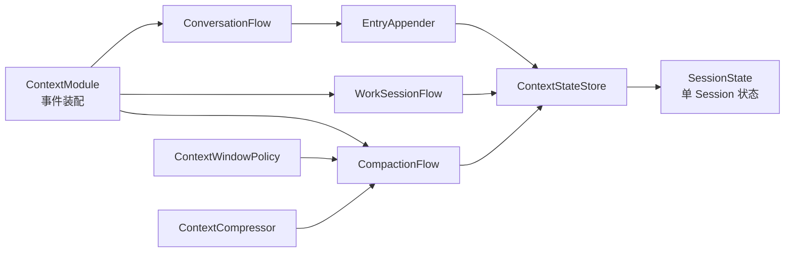

# Context 核心开发指南

本文面向维护 `core.context` 的开发者，帮助开发者快速建立源码模型，并明确修改时不能破坏的行为。业务 Module 的接入方式见[外部开发文档](../../../docs/modules/context/README.md)。

## 1. 架构概览

Context 以 Session 作为上下文的隔离单元。Body 输入到达后，`ConversationFlow` 先确定 Session ID；如果该 Session 尚未加载，就发布恢复事件，请持久化模块返回此前保存的状态。恢复完成后，本次输入被写成带顺序号的 Entry，近期 Entry 与较早内容的 Summary 一起通过 `context.prepared` 交给 Agent。

Context 只在进程内维护当前使用的 Session。外部 Module 根据 `context.state.changed` 持久化变化；当未摘要的 Entry 超过窗口阈值时，Context 在后台把较早内容逐步整理成多级 Summary。



运行时调用链是：Body 输入 → ConversationFlow 恢复或取得 Session → EntryAppender 写入 Entry → 发布 `context.state.changed` 和 `context.prepared` → CompactionFlow 在需要时生成 Summary。

- `ContextModule` 是入口，负责创建内部 Flow 并把事件 Handler 注册到 Event；
- `ConversationFlow` 接收 Body 输入，找到或恢复 Conversation Session，写入用户 Entry 后发布 `context.prepared`；
- `WorkSessionFlow` 根据 `purpose + work_id` 找到或创建 Work Session，并发布 ready 或 failed；
- `EntryAppender` 是两类追加路径共用的步骤，写入完成后发布状态变化并检查是否需要摘要；
- `ContextStateStore` 保存当前进程已经加载的 Session，`SessionState` 维护其中一个 Session 的实际数据和写入规则；
- `ContextWindowPolicy` 决定哪些旧内容应该被摘要，`ContextCompressor` 生成摘要文本；
- `CompactionFlow` 执行一次摘要任务，并在原内容仍然有效时把结果写回 Store。

推荐阅读顺序：

1. `contracts.py`：认识 Session、Entry、Summary 和事件载荷；
2. `events.py`：查看 Context 注册了哪些事件和 Handler；
3. `conversation.py`：理解普通输入与冷恢复；
4. `entry_appender.py`：理解追加后的共同动作；
5. `store.py` 与 `state.py`：理解状态边界和不变量；
6. `window.py`、`compaction.py`、`compression.py`：理解滚动压缩；
7. `work_session.py`：理解独立任务上下文。

如果只排查某条事件链，可以从 `events.py` 找到对应 Handler，再沿调用关系往下看。

## 2. 边界和文件职责

Context 只处理会话上下文：确定记录属于哪个 Session、维护 Entry 的先后顺序、在首次访问时读取旧状态，并随着内容增长维护可供 Agent 使用的工作窗口。

而正文的解释、Agent 决策、数据库读写和 Body 的平台路由都由其他模块完成。

| 文件 | 内容 |
|---|---|
| `__init__.py` | 业务侧稳定导出 |
| `contracts.py` | Context 数据结构和事件载荷 |
| `identity.py` | 从稳定业务身份生成 Session ID |
| `events.py` | 内部组装、事件定义和 Handler 注册 |
| `conversation.py` | 对话输入、冷恢复和 prepared 事件 |
| `work_session.py` | Work Session 解析与冷恢复 |
| `entry_appender.py` | 追加完成后的公共流程 |
| `store.py` | 已加载 Session 的集合和生命周期入口 |
| `state.py` | 单 Session 的追加、关闭和摘要规则 |
| `window.py` | 压缩时机和分组策略 |
| `compression.py` | 压缩输入与摘要模型调用 |
| `compaction.py` | 压缩任务的调度和提交 |

必须保持的不变量：

- 一个 Session 只对应一个 Context，Entry 和 Summary 不跨 Session；
- 同一段对话或同一个任务在重启前后仍得到相同 Session ID；
- Entry sequence 在 Session 内严格递增；
- 恢复快照安装前必须重新校验身份；
- 压缩只处理当前仍有效、尚未被其他摘要替代的 Entry 或 Summary；
- Context 不直接依赖其他业务 Module 的 Runtime 或 Repository。

放置新逻辑时，先判断它属于流程协调、状态规则还是窗口策略。不要因为逻辑从某个 Handler 进入，就直接把实现写在 Handler 中。

## 3. 数据与身份

公开字段见[公开 API](../../../docs/modules/context/public-api.md)。内部实现主要围绕 Session、Entry、Summary 和 Snapshot 维护状态。

### Session 与 Context 一一对应

`session_id` 同时标识 Session 及其 Context。身份来源有两种：

- Conversation Session：由稳定的 Conversation Scope 派生；
- Work Session：由规范化后的 `purpose` 和稳定 `work_id` 派生。

Session ID 是确定性结果，同一业务身份在重启后仍得到相同 ID。外部只保存和传递，不解析其格式。

### Entry

写入前使用 `ContextEntryDraft`，写入后得到 `ContextEntryRecord`。`entry_id`、`session_id`、严格递增的 `sequence` 和 `created_at` 都在写入时分配。一批 Draft 按传入顺序整体追加；批次不能为空，已关闭 Session 拒绝写入。

`sequence` 才是 Session 内的实际顺序。异步 Handler 的完成顺序可能不同，不能拿它来判断哪条内容更新。

### Summary

Summary 表示当前工作窗口如何用一个摘要节点代替一段旧内容。

- Level 1 Summary 直接覆盖一段连续的原始 Entry；
- Level 2 及以上 Summary 覆盖一组连续、同级的活动 Summary；
- `first_sequence` 和 `last_sequence` 始终指向最初 Entry 的序号范围；
- `source_summary_ids` 记录高层摘要直接对应的下级节点。

当前用于组成工作窗口的 Entry 和 Summary 合在一起称为“活动前沿”。Entry 被 Summary 覆盖后，不再出现在活动 `entries` 中；低层 Summary 被更高层 Summary 覆盖后，也不再出现在活动 `summaries` 中。这里的“覆盖”只表示退出当前窗口，不表示删除持久化历史。

持久化层仍可保留完整历史。增量事件中的稳定 ID 和覆盖关系用于维护当前前沿，并为以后展开历史保留依据。

### Snapshot

`ContextSnapshot` 是某一时刻的冻结视图，包含 Session、最新 sequence、当前 Entry 和 Summary。Flow 和事件载荷只传递 Snapshot 或其他不可变结构，不暴露 `SessionState` 的内部 list。

## 4. 事件装配与 Conversation 生命周期

### Event 装配入口

`ContextModule.register()` 注册 Context 拥有的事件和以下 Handler：

| 输入事件 | Handler | 作用 |
|---|---|---|
| `body.input.received` | `ConversationFlow.handle_input` | 接收普通对话输入 |
| `context.append.requested` | `ContextModule._handle_append` | 追加模块产生的 Entry |
| `context.work.requested` | `WorkSessionFlow.handle_request` | 解析 Work Session |
| `context.restore.resolved` | Conversation 与 Work Flow | 恢复各自等待的请求 |
| `context.compaction.requested` | `CompactionFlow.handle_request` | 执行一次后台压缩 |

Conversation 和 Work Flow 都订阅恢复结果，但只接收自己保存过的 `operation_id`。历史事件已经注册，读取 Handler 尚未实现。

### 已加载 Session

收到 `body.input.received` 后，`ConversationFlow`：

1. 从 Conversation Scope 计算稳定 `session_id`；
2. 确认该 Session 已经加载；
3. 把输入转换为 USER_MESSAGE Entry 并追加；
4. 发布状态变化，必要时安排压缩；
5. 发布 `context.prepared`。

`context.prepared` 中的 Entry 和 Summary 来自追加后的 Snapshot，因此一定包含本轮刚接纳的输入。`trigger_entry_id` 明确指出其中哪条 Entry 触发了本轮处理。

### 冷恢复

程序启动后，Store 中还没有某个 Session 的进程内状态。第一次收到该 Session 的输入时，`ConversationFlow` 在 `_restoring` 中保存一次待恢复操作，其中包括恢复 `operation_id`、Conversation Scope 和等待处理的输入列表，然后发布 `context.restore.requested`。

恢复完成前再次到达同一 Session 的输入，只追加到这份列表，不会重复发起恢复。收到 `context.restore.resolved` 后，Flow 先安装快照或初始化 Session，再按输入进入列表的顺序继续处理。

`completed` 会在身份校验后安装 Snapshot，`not_found` 初始化新 Session，`failed` 拒绝本批输入。数据库或网络错误不能伪装成 `not_found`。

### 输入失败

恢复失败、快照身份不匹配或追加被拒绝时发布 `context.input.failed`，不再发布对应的 `context.prepared`。意外 Handler 异常仍由 Event 隔离和记录；错误消息不携带完整 Context 正文。

## 5. Work Session 生命周期

Work Session 用于任务、日记或其他需要独立上下文的长期工作。它不是一次函数调用产生的临时缓存。

请求方发布 `context.work.requested`，携带自己的 `operation_id`、稳定 `work_id`、开放的 `purpose` 和可选 `parent_session_id`。`WorkSessionFlow` 规范化身份并计算 Session ID，已加载时直接发布 ready，未加载时先请求恢复。

流程中有两种关联 ID：

- 请求方的 `operation_id`：用于匹配 `work.ready` 或 `work.failed`；
- Context 创建的恢复 operation ID：只用于匹配一次 `restore.resolved`。

前者属于业务请求，后者只用于 Context 与持久化模块之间的恢复。恢复后：

- 快照存在且身份一致时安装快照；
- 快照不存在时创建新的 Work Session；
- 首次创建时发布 `context.state.changed`；
- 最终发布 `context.work.ready` 或 `context.work.failed`。

同一 Work Session 再次请求时，`parent_session_id` 必须保持一致。

## 6. 追加、Store 与状态

### EntryAppender 与状态事件

Conversation 输入和显式 `context.append.requested` 都通过 `EntryAppender` 写入 Store，随后发布状态变化并检查是否需要压缩。

`EntryAppender.append()` 本身不发布事件，这使恢复批次可以先按确定顺序完成全部同步追加，再分别恢复每条输入的事件链。

`context.state.changed` 是增量持久化事件。常见形态如下：

| 变化 | `appended_entries` | `created_summary` |
|---|---|---|
| 新建 Work Session | 空 | `None` |
| 追加 Entry | 本次新增 Entry | `None` |
| 完成压缩 | 空 | 新 Summary |

事件同时携带最新 Session 状态。持久化消费者按稳定 ID 幂等写入。`context.append.requested` 当前没有结果事件；若业务需要确认，应补充事件契约，而不是读取 Store。

### ContextStateStore

Store 是当前进程已加载 Session 的集合。它负责初始化 Conversation Session、解析 Work Session、安装恢复 Snapshot，并把追加和压缩交给对应的 `SessionState`。

恢复安装必须通过 Conversation 或 Work 专用入口。两个入口会重新计算稳定 ID，并检查 purpose、scope、work ID 和 parent 关系，防止错误快照污染另一个 Session。

### SessionState

一个 Session 的状态规则最终都落在 `SessionState`：

- Entry sequence 严格递增；
- 一批 Entry 按顺序整体追加；
- 关闭与最后一批追加可以在同一次状态更新中发生；
- 已关闭 Session 不再接受追加或压缩；
- 压缩只能消费仍处于活动前沿且与计划完全匹配的节点；
- 过期或重复的压缩提交不修改状态。

新的状态规则也应在这里校验，避免其他调用路径绕过 Flow 中的提前检查。

## 7. 窗口与分层压缩

### 默认策略

`ContextWindowPolicy` 当前默认值：

| 参数 | 默认值 | 含义 |
|---|---:|---|
| `recent_entries` | 24 | 压缩后保留的近期原始 Entry |
| `compression_trigger_entries` | 40 | 活动 Entry 超过该数量后开始规划 Level 1 |
| `summary_fanout` | 8 | 同级 Summary 达到该数量后晋升 |
| `compaction_lookahead_entries` | 8 | 提供给摘要器的后续参考 Entry 数量 |

这些值属于运行策略，调整后需要一起观察上下文质量、模型开销和压缩频率。

### 规划与执行分离

窗口策略接收 Snapshot，只返回 `CompactionRequestData` 或 `None`。它不修改状态，也不调用模型。

压缩流程是：

1. Policy 根据当前 Snapshot 生成计划；
2. `CompactionFlow` 把 Session ID 加入 `_scheduled`，防止同一 Session 重复调度；
3. 通过内部事件异步执行压缩；
4. Compressor 根据目标内容生成摘要文本；
5. Store 用当前状态重新校验计划；
6. 提交成功后发布 `context.state.changed`；
7. 再检查是否可以继续晋升下一层。

每个 Session 同时只保留一个压缩任务，不同 Session 可以独立推进。

### 提交保护

`context_before` 和 `context_after` 只供模型理解上下文，不属于覆盖范围；提交只依据 `items` 和 `source_summary_ids`。

Compressor 调用期间状态可能变化，因此 `SessionState.compact()` 会重新检查目标节点。过期或重复请求返回 `None`，不修改状态。

### 可选 Compressor

`ContextCompressor` 是文本生成边界，`LLMCompressor` 是当前实现。未配置 Compressor 时窗口仍会滚动，但 Summary 文本为空；Compressor 返回 `None` 时不提交本次结果，并释放 `_scheduled` 中的 Session ID。

## 8. 并发、追踪与失败边界

### Entry 的顺序

`SessionState.append()` 是同步操作，执行过程中没有 `await`。因此一次批量追加不会被其他协程插入，批内 Entry 会得到连续 sequence。

这个保证不等于“事件到达顺序就是 sequence 顺序”。多个事件可以由不同 worker 并发分发，sequence 反映的是实际进入 `append()` 的顺序。依赖先后的业务逻辑应读取 sequence，不使用 Handler 完成时间。

冷恢复时，同一 Session 的输入先进入 `_restoring` 队列。恢复结果到达后，`ConversationFlow` 会在第一次 `await` 之前按队列顺序完成这一批追加，再逐条发布后续事件，避免新输入插到恢复批次中间。

### 压缩期间的并发

Compressor 调用包含 `await`，等待期间同一 Session 仍可追加 Entry。因此压缩计划只是候选结果，提交时必须由 `SessionState.compact()` 对照当前活动节点重新校验。计划过期时返回 `None`，不能覆盖新状态。

`_scheduled` 只保证单个 `CompactionFlow` 实例内每个 Session 最多有一个压缩任务。它不是跨线程或跨进程锁。

### 事件追踪

已加载 Session 的后续事件直接通过当前 `EventFlow` 发布。冷恢复完成时原 Flow 已经结束，所以 `_PendingInput` 保存原始 Envelope，再通过 `EventClient.emit(parent, ...)` 延续各自的 trace 和父子关系。

`operation_id` 只匹配一次异步请求和结果，不替代 Event 的 trace。恢复结果没有匹配的 operation 时，说明它不属于当前 Flow、已经过期或重复到达，Handler 直接忽略。

### 失败如何处理

Context 只把调用方需要感知的失败发布为业务事件：Conversation 输入失败使用 `context.input.failed`，Work Session 失败使用 `context.work.failed`。调用方判断稳定 `code`，`message` 只用于诊断且不包含完整正文。

`context.append.requested` 当前没有失败结果事件。其 Handler 若抛出异常，由 Event 记录并隔离，发布者不会收到业务失败通知。

过期压缩或不属于当前请求的恢复结果不表示业务失败，直接忽略。其他未预期的 Handler 异常同样由 Event 隔离，不应让 Context 自行吞掉后继续发布成功事件。

上述保证建立在单进程事件循环和所有状态写入都经过 Context 的前提下。多线程直接调用 Store、多实例共享状态或接入消息队列时，需要重新设计状态所有权、并发控制和投递幂等。

## 9. 组合根

组合根创建 Store、Policy 和可选 Compressor，再把 owner 为 `context` 的 `ModuleEventAPI` 交给 `ContextModule.register()`。Context 不应查找全局 EventBus，也不应在 import 时注册 Handler。完整装配示例见[接入指南](../../../docs/modules/context/integration-guide.md#5-在组合根安装)。

## 10. 修改指引

| 修改目标 | 优先位置 |
|---|---|
| 事件或载荷 | `contracts.py`、`events.py`、公开文档 |
| Session 身份 | `identity.py`，并检查持久化兼容性 |
| 状态不变量 | `state.py` |
| Session 生命周期入口 | `store.py` |
| 对话或 Work 流程 | `conversation.py`、`work_session.py` |
| 压缩触发与分组 | `window.py` |
| 摘要模型调用 | `compression.py` |
| 压缩调度与提交 | `compaction.py` |

如果新需求是在解释业务结果、执行 Agent 决策或操作数据库，它就不该放进 Context Flow，而应由对应模块订阅事件处理。

修改公开契约时，一起检查 Event 的 `payload_type`、`core.context` 导出、外部文档、持久化兼容性和测试。事件含义、关联 ID 和时序也是契约的一部分，不只是 dataclass 字段。

## 11. 测试和排错

在仓库根目录运行 Context 单元测试：

```powershell
$env:PYTHONPATH = "src"
python -m unittest discover -s tests/context -p "test_*.py" -v
```

核心测试分为四组：

- 身份与状态：Session ID、sequence、批量追加和关闭语义；
- 恢复流程：completed/not_found/failed、输入队列顺序和身份不匹配；
- Work 流程：operation ID、Session 复用和 parent 冲突；
- 压缩流程：节点覆盖、层级晋升、重复或过期计划。

Flow 测试通过事件接口观察结果；`SessionState` 不变量可以直接使用 Store 和 Snapshot 测试。

## 12. 当前限制和提交检查

当前范围：

- Store 只保存本进程已经加载的状态；
- 历史展开尚未实现 Handler；
- 显式追加没有结果事件，也没有独立幂等键；
- 压缩调度只在单个 Context 实例内去重；
- 未配置 Compressor 时生成空文本 Summary。

这些限制应在具体链路需要时逐步处理，不必提前把 Context 扩展成通用工作流框架。

提交前确认：

- [ ] Context 没有直接依赖其他业务 Module 的实现；
- [ ] Session 身份、Entry sequence 和关闭规则仍由 State 统一维护；
- [ ] 恢复快照安装前重新校验身份；
- [ ] 冷恢复期间同一 Session 只发起一次请求；
- [ ] 每条排队输入保留原 trace 和父事件关系；
- [ ] 过期或重复压缩不会再次改变状态；
- [ ] 新公开对象已同步到 `core.context.__all__`、文档和测试。
