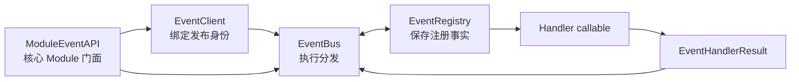
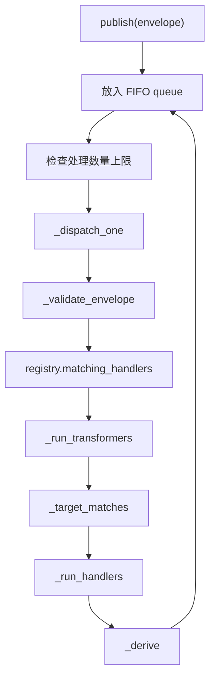

# Event 核心开发指南

本文面向维护 `core.event` 的开发者，解释当前实现的内部结构、调用链、状态不变量和修改方式。业务 Module 如何接入 Event，请阅读[公开开发文档](../../../docs/modules/event/README.md)。

## 1. 先建立整体认识

Event 是业务无关的进程内通信核心。它接收通用事件信封，根据运行时注册信息查找 Handler，隔离执行失败，维护追踪关系，并同步处理 Handler 产生的派生事件。



第一次阅读代码时，建议按以下顺序：

1. `contracts.py`：理解系统处理的数据；
2. `registry.py`：理解事件和 Handler 如何被保存、匹配和注销；
3. `bus.py`：理解一次 publish 的执行流程；
4. `client.py`：理解 source 身份和发布权限如何建立；
5. `patterns.py`、`errors.py`、`protocols.py`：补充通用规则。

## 2. 必须保持的边界

Event 核心只负责：

- 信封基础校验和可选 Payload 类型校验；
- EventSpec、HandlerSpec 和 callable 的动态注册；
- Handler 匹配、排序、调用和失败隔离；
- target、broadcast、unicast 和 Transformer 语义；
- 根事件与派生事件的追踪；
- 分发结果、错误和注册生命周期。

Event 核心不得：

- 导入 Body、Context、Agent、Memory、Data、Tool 或插件实现；
- 根据具体 `event_type` 编写路由分支；
- 解释 Payload 的业务字段；
- 判断 Session、用户或具体业务权限；
- 持有业务 Runtime、Manager 或 Repository；
- 因新增业务事件或 Handler 修改 EventBus。

如果新需求要求 EventBus 认识某个业务名称，应优先把规则表达为事件契约、Handler 注册信息、Payload 或 Event 之外的宿主 Adapter。

## 3. 文件职责

| 文件 | 核心职责 | 修改时关注 |
|---|---|---|
| `contracts.py` | 信封、注册声明、Handler 结果和分发结果 | 字段变更会影响所有调用者 |
| `registry.py` | 注册状态、索引、匹配、排序和注销 | 索引一致性与 callable 引用释放 |
| `bus.py` | 校验、Handler 执行、派生事件和结果汇总 | 外部可观察的分发语义 |
| `client.py` | owner 绑定、根信封构造和发布授权 | source 可信度与权限一致性 |
| `patterns.py` | exact、尾部通配和全局通配 | 注册匹配与发布授权共同使用 |
| `errors.py` | 结构化错误和边界异常 | 错误脱敏与稳定错误码 |
| `protocols.py` | Handler 与 Logger Protocol | 避免依赖具体基础设施实现 |
| `__init__.py` | Event 的公开导出 | 新公开对象必须显式加入 `__all__` |

职责划分的关键是：Registry 保存事实，Bus 执行流程，Client 建立调用身份。不要把三者合并成一个包含业务判断的集中式路由器。

## 4. 核心数据结构

### EventEnvelope

`EventEnvelope` 是 EventBus 的输入单位，使用 frozen dataclass：

- `event_id`：当前事件唯一 ID；
- `event_type`：开放字符串事件名；
- `occurred_at` / `emitted_at`：业务发生时间和发出时间；
- `source_owner_id` / `target_owner_id`：发布身份和可选目标；
- `trace`：trace ID 与直接父事件 ID；
- `payload`：Event 不解释的业务对象；
- `metadata`：通用附加信息。

`__post_init__()` 校验必要 ID，并把 metadata 浅复制为 `MappingProxyType`。这只保证信封字段和 metadata 映射不能直接修改，不会深冻结 Payload 或 metadata 内部的可变对象。

### EventSpec 与 HandlerSpec

`EventSpec` 描述事件 owner、可选 Payload 类型和分发模式。Registry 要求一个 `event_type` 只能注册一次。

`HandlerSpec` 描述 Handler 身份、owner、事件 pattern、priority、kind、timeout 和派生事件发布 pattern。同一 owner 内 `handler_id` 必须唯一。

### Handler 结果

Handler 必须返回 `EventHandlerResult`：

- `handled` 控制 unicast Consumer 是否接受事件；
- `transform` 只允许 Transformer 使用；
- `derived_events` 保存后续发布请求；
- `metadata` 进入 `HandlerExecutionResult`；
- `error` 表示 Handler 主动报告的结构化失败。

`_DispatchAccumulator` 把每次执行转换为 `HandlerExecutionResult`，同时收集错误和派生请求。一次根 publish 产生的所有信封和 Handler 结果都进入同一个 `EventDispatchResult`。

当前 `record()` 会无条件收集 `derived_events`，即使该 Handler 同时返回了 error。若要改成“失败时禁止派生”，必须先明确外部语义并增加兼容测试，不能只修改一处分支。

## 5. EventRegistry

### 内部索引

Registry 当前维护：

```text
_events:               event_type -> (registration_id, EventSpec)
_handlers:             registration_id -> HandlerRegistration
_handler_keys:         (owner_id, handler_id) -> registration_id
_owner_registrations:  owner_id -> set[registration_id]
_tokens:               registration_id -> RegistrationToken
_order:                单调递增的 Handler 注册序号
```

每个新增索引都必须能通过单项注销和 owner 注销完整清理，否则会产生幽灵注册或保留 Handler callable 强引用。

### 注册事件

`register(EventSpec)` 的流程：

1. `_validate_event_type()` 校验事件名；
2. 检查 event type 是否已存在；
3. 生成 registration ID；
4. 写入 `_events` 和 owner 索引；
5. 创建并保存 `RegistrationToken`。

重复事件不会覆盖已有定义，而是抛出带有 `registration_conflict` 的 `EventRegistrationError`。

### 注册 Handler

`subscribe(HandlerSpec, handler)` 的流程：

1. 校验 pattern；
2. Transformer 额外要求精确订阅已经注册的事件；
3. 检查 `(owner_id, handler_id)` 是否重复；
4. 增加注册序号；
5. 写入 Handler 主记录、唯一键索引和 owner 索引；
6. 返回 RegistrationToken。

Transformer 必须在目标事件注册之后注册，因此组合根的启动顺序会影响 Transformer 安装。

### pattern 和排序

只支持三类 pattern：

```text
body.input.received   # exact
body.*                # trailing wildcard
*                     # global wildcard
```

`matching_handlers()` 遍历当前 Handler，调用 `event_pattern_matches()`，然后按 `(priority, order)` 排序。priority 越小越先执行，同 priority 保持注册顺序。

当前实现每次 publish 都动态遍历 Handler，没有缓存匹配结果。以后若增加缓存，注册和注销必须同步失效缓存。

### 注销

`RegistrationToken.unregister()` 调用 Registry，并通过 `active` 保证幂等。`unregister_owner()` 遍历 owner 索引并复用单项注销逻辑。

当前注销没有级联关系：

- 注销一个 EventSpec 不会自动删除其他 owner 对该事件的 Handler；
- 注销一个 Handler 不影响事件定义；
- `unregister_owner()` 只清理该 owner 自己拥有的注册。

因此事件 owner 卸载后，其他 owner 的订阅可能仍保留在 Registry 中，只是事件未重新注册前不会被执行。改变这一行为需要先定义跨 owner 生命周期语义。

## 6. EventBus 的 publish 调用链



### publish()

`publish()` 为每次根调用创建：

- 一个空的 `EventDispatchResult`；
- 一个以根信封开始的 FIFO `deque`；
- 一个已处理信封计数器。

循环每次取出一个信封，通过 `_dispatch_one()` 分发，将最终有效信封加入 `result.envelopes`，再把合法派生事件追加到队尾。因此当前派生顺序是广度优先。

`max_dispatch_depth` 虽然名称包含 depth，当前限制的是一次 publish 最多处理的信封总数。达到上限后记录 `handler_failed` 并放弃队列中剩余信封。

### _dispatch_one()

单个信封依次经历：

1. `_validate_envelope()` 获取 EventSpec，并校验 Payload 类型；
2. Registry 动态匹配和排序 Handler；
3. 筛出 Transformer 并依次运行；
4. 使用转换后的最终信封过滤 Consumer 和 Observer；
5. 执行主 Handler；
6. 返回派生请求、最终信封和本信封的选择错误。

未注册或 Payload 非法时不调用 Handler，但原信封仍会加入 `result.envelopes`，错误加入总结果。

## 7. 三类 Handler 的执行语义

### Transformer

Transformer 在 Consumer 和 Observer 之前执行，并且当前不应用 `target_owner_id` 过滤。它只能返回 `EventTransform` 来替换 Payload，不能修改 event type、source、target 或 trace。

每次成功转换都使用 `dataclasses.replace()` 生成新信封。若新 Payload 不满足 EventSpec：

1. 记录 `payload_invalid`；
2. 保留上一个合法信封；
3. 继续执行后续 Transformer 和主 Handler。

Transformer 返回自身 error 时不会应用它同时提供的 transform。

### Consumer

- broadcast：按排序结果执行全部 Consumer；
- unicast：仅“没有 error 且 `handled=True`”算接受，随后停止执行剩余 Consumer；
- unicast 所有 Consumer 都拒绝或失败时返回 `handler_not_found`。

### Observer

Observer 总是在 Consumer 阶段后执行，不参与 unicast 接受竞争。target 过滤同时适用于 Consumer 和 Observer。

当前边缘行为：

| Handler 情况 | broadcast | unicast |
|---|---|---|
| 无 Consumer、无 Observer | `handler_not_found` | `handler_not_found` |
| 只有 Observer | 执行 Observer，不报未处理 | 执行 Observer，再报 `handler_not_found` |
| Consumer 报错 | 继续后续 Consumer | 继续寻找可接受 Consumer |

如果修改这些行为，应先更新公开契约，而不是只调整 `_run_handlers()`。

## 8. Handler 调用与错误隔离

所有 Handler 最终通过 `_invoke()` 调用：

1. 创建 coroutine；
2. 有 timeout 时使用 `asyncio.wait_for()`；
3. 校验返回值必须是 `EventHandlerResult`；
4. 将超时和未知异常转换为结果型错误。

具体规则：

- timeout -> `handler_timeout`，`retryable=True`；
- 抛出异常 -> 内部 Logger 记录堆栈，对外返回 `handler_failed`；
- 返回其他类型 -> `handler_failed`；
- 非 Transformer 返回 transform -> `_invoke_handler()` 记录 `permission_denied`；
- Handler 主动返回 error -> 原样记录到执行结果和总错误列表。

`asyncio.CancelledError` 不属于普通 Handler 失败，当前不会被 `except Exception` 转换，会继续向上传播。不要为了“兜底”改成捕获 `BaseException`，除非同时定义清楚任务取消语义。

公开错误不能包含完整 Payload、密钥或原始异常消息。允许记录异常类型和 Handler/owner 等定位信息。

一个 Handler 的失败不能阻止无依赖的后续 Handler，但 unicast 的停止规则仍然只由首个成功接受者决定。

## 9. 派生事件

Handler 返回 `EventPublishRequest`，而不是完整 EventEnvelope。这样 Handler 无法直接指定可信 source、event ID 或 trace。

`_derive()` 按以下顺序处理：

1. 确认派生事件已经注册；
2. 调用 `_may_publish()` 校验发布权限；
3. 继承父 metadata，再用请求 metadata 覆盖同名字段；
4. 生成新 event ID 和 emitted time；
5. 使用请求的 occurred time，未提供时使用当前时间；
6. 使用 Handler owner 作为 source；
7. 继承父 trace ID，并把父 event ID 写入 `parent_event_id`；
8. 将子信封放回 publish 队列。

派生 Payload 类型不会在 `_derive()` 中立即校验，而是在子信封下一次进入 `_dispatch_one()` 时校验。

发布权限规则为：Handler 可以发布自己 owner 的事件，或 `HandlerSpec.publish_patterns` 允许的事件。两处授权实现必须保持一致：

- 根事件：`EventClient._authorize()`；
- 派生事件：`EventBus._may_publish()`。

修改 pattern 语义时必须同时验证注册匹配和这两处发布授权。

## 10. EventClient 与 ModuleEventAPI

### EventClient

`EventClient` 在创建时绑定 `owner_id` 和 `publish_patterns`。

`publish()` 先授权，再由 `_build()` 生成根信封：新 event ID、新 trace ID、当前时间、绑定 owner 作为 source。调用方只提供 event type、Payload、target 和 metadata。

授权发生在 EventBus 校验之前：未注册事件若不匹配 Client 权限会先抛 `EventPermissionError`；若已被 publish pattern 允许，则进入 Bus 后返回 `event_not_registered`。

`derived()` 只授权并构造 `EventPublishRequest`，不会立即分发。真正的派生 source 和 trace 在 Handler 返回结果后由 Bus 生成。

当前 `_build()` 接收的 `spec` 参数没有参与信封构造，这是现有实现遗留，不应误认为它会自动设置 target 或执行 Payload 校验。

`EventBus.publish()` 接收完整信封并信任其中的 source，不执行 Client 身份校验。因此原始 Bus 只应由组合根和 Event 基础设施持有，不能作为普通 Module 或第三方插件的发布入口。

### ModuleEventAPI

`ModuleEventAPI` 是受信核心 Module 的便捷门面：

- `register()` 补全 EventSpec.owner_id；
- `subscribe()` 补全 HandlerSpec.owner_id；
- `derived()` 委托绑定 owner 的 Client；
- `client` 用于发布根事件。

当前权限行为需要特别注意：

- `create()` 为核心 Client 配置 `publish_patterns=("*",)`；
- `subscribe()` 虽接收 `publish_patterns`，构造 HandlerSpec 时却固定写入 `("*",)`。

因此核心 Module 当前默认拥有跨命名空间发布能力，传入 `subscribe()` 的 pattern 不会收紧权限。这不是第三方插件的安全边界；插件接入应由宿主提供新的受限门面。

## 11. 错误模型

Event 使用两种失败表达：

| 发生阶段 | 表达方式 | 示例 |
|---|---|---|
| 分发前的声明或身份错误 | 抛异常 | 注册冲突、Client 发布越权、信封必要 ID 缺失 |
| 已进入分发的可隔离失败 | `EventError` 写入结果 | Payload 非法、Handler 超时或异常、无 Handler |

`EventRegistrationError` 和 `EventPermissionError` 都保留原始结构化错误在 `.error` 属性中。

新增错误时：

- `code` 必须稳定且可供程序判断；
- `message` 只用于人类诊断；
- `details` 只放安全的定位信息；
- `retryable` 表示是否允许上层重试，不触发 EventBus 自动重试；
- 同步增加错误路径测试和公开文档。

## 12. 生命周期与并发

当前 Registry 设计用于应用启动和停止阶段，没有为 publish、注册和注销并发提供事务语义。

推荐生命周期：

```text
创建 EventBus
  -> 注册 EventSpec
  -> 注册 Handler（Transformer 必须晚于目标事件）
  -> 开放业务输入
  -> 停止新输入
  -> 等待必要的在途调用
  -> unregister_owner()
  -> 释放业务 Runtime
```

`matching_handlers()` 返回新的列表，因此已经进入某次分发的 Handler 列表不会因为随后注销而被可靠撤回。若未来支持热插拔，需要先定义注册快照、在途调用和卸载等待语义，再选择锁或版本化 Registry，不能只给部分字典加锁。

## 13. 常见修改应落在哪里

### 新增业务事件或 Handler

不修改 `core.event`。在业务 Module 定义 Payload 并通过 ModuleEventAPI 注册。

### 修改事件名或 pattern 规则

修改 `registry.py` 的校验和 `patterns.py` 的匹配，并同时验证：

- Handler 订阅匹配；
- EventClient 发布授权；
- 派生事件发布授权；
- 已有事件名兼容性。

### 新增 HandlerKind

需要同时修改 contracts 和 Bus，并明确：

- 它在 Transformer、Consumer、Observer 中的相对阶段；
- 是否接受 target 过滤；
- 是否参与 unicast；
- 是否允许 transform 或派生事件；
- 失败如何记录；
- HandlerExecutionResult 如何表达。

### 修改分发顺序或并发执行

这是公开语义变更。必须考虑 priority、unicast 短路、Observer 顺序、派生事件顺序、异常隔离和结果列表顺序。不能只把循环替换为 `gather()`。

### 增加插件接入

在 Event 核心之外实现宿主门面，把插件 Manifest 转换为 owner、事件命名空间以及发布/订阅 pattern。EventBus 不应导入插件加载器或 Manifest 类型。

### 增加消息队列

出现第二个真实 Transport 后再提取接口，并明确序列化、确认、重试、幂等、顺序和跨进程 trace。当前 callable Registry 不能直接等同于跨进程订阅。

## 14. 测试与排错

核心改动至少覆盖受影响的维度：

- 事件名和 pattern 校验；
- 重复事件及重复 `(owner_id, handler_id)`；
- exact、尾部通配和全局通配；
- priority 和注册顺序；
- broadcast、unicast、Observer 和 target；
- Transformer 链、失败回退和转换后 Payload 校验；
- Handler 正常返回、主动 error、非法返回、异常和超时；
- 派生权限、source、target、metadata、occurred time 和 trace；
- FIFO 派生顺序与处理数量上限；
- Token 单项注销、重复注销和 owner 清理；
- Event 核心不导入业务 Module。

排错时优先查看 `EventDispatchResult`：

1. `envelopes` 判断事件是否进入分发以及最终 Payload；
2. `handlers` 判断实际执行了谁、是否 handled、是否主动报错；
3. `errors` 根据 code 判断失败阶段；
4. trace ID 和 parent event ID 还原派生关系；
5. 内部 Logger 查看被脱敏前的 Handler 异常堆栈。

业务事件的案例测试应放在所属 Module；Event 核心测试只固化通用语义。

## 15. 提交前检查

- [ ] Event 是否仍然不知道具体业务 Module 和事件名？
- [ ] 新状态是否在单项注销和 owner 注销中完整清理？
- [ ] pattern 的匹配与两条授权路径是否一致？
- [ ] Handler 排序、target 和三种 kind 的语义是否保持？
- [ ] 异常、超时和非法返回是否继续隔离并脱敏？
- [ ] owner、source、target、trace 和 metadata 继承是否正确？
- [ ] 外部可观察行为变更是否包含测试和公开文档更新？
- [ ] 新公开对象是否加入 `core.event.__init__.__all__`？
