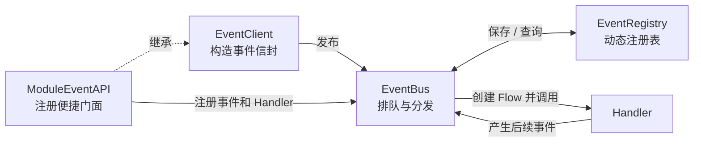
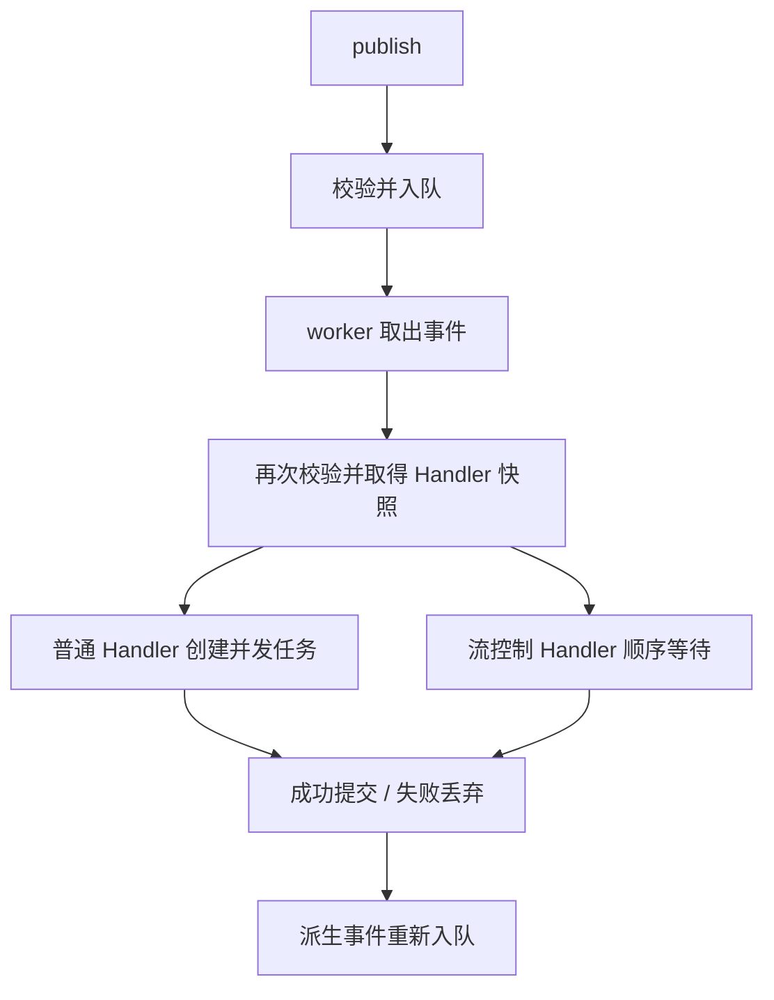

# Event 核心开发指南

本文面向维护 `core.event` 的开发者，帮助开发者快速建立源码模型，并明确修改时不能破坏的行为。业务 Module 的接入方式见[外部开发文档](../../../docs/modules/event/README.md)。

## 1. 架构概览

Event 是业务无关的进程内异步通信核心：Client 负责构造事件，Registry 保存动态注册，Bus 负责队列和分发，Flow 隔离单次 Handler 调用产生的操作。



主要对象之间的关系：

- `EventClient` 绑定 owner（Module 或 Adapter 的稳定身份），并补齐 ID、时间和 trace；
- `ModuleEventAPI` 继承 EventClient，增加 register/subscribe；
- `EventRegistry` 保存 EventSpec、HandlerSpec 和 Handler 函数；
- `EventBus` 管理生命周期、队列、匹配和调用；
- `EventFlow` 暂存 Handler 的 Payload 修改、停止标记和派生事件。

运行时调用链是：Client 发布 → Bus 校验并入队 → worker 查询 Registry → Bus 创建 Flow 并调用 Handler → Handler 正常结束后提交 Flow。

推荐阅读顺序：`envelope.py`、`contracts.py` → `registry.py` → `flow.py` → `bus.py` → `client.py`。后续章节也按这个顺序解释源码。

## 2. 边界和文件职责

Event 只处理通用通信：信封校验、动态注册、Handler 分发、基础超时、异常隔离、事件追踪和队列生命周期。

Event 不得导入业务 Module，不解释 Payload，不做其他任何业务直接相关实现。理论上，增加新的业务不应该对 Event 做出修改。

| 文件 | 职责 |
|---|---|
| `envelope.py` | `TraceInfo`、`EventEnvelope` 和只读 metadata |
| `contracts.py` | `EventSpec`、`HandlerSpec` |
| `registry.py`、`patterns.py` | 注册、匹配、排序和注销 |
| `flow.py` | Handler 操作的暂存、提交与丢弃 |
| `bus.py` | 状态机、队列、分发和派生事件 |
| `client.py` | 信封构造和 Module 门面 |
| `errors.py`、`protocols.py` | 错误、Handler 和 Logger 协议 |
| `__init__.py` | `core.event` 的公开导出 |

必须保持的不变量：

- 一个 event type 只有一个 EventSpec；
- 同一 owner 内 Handler ID 唯一；
- source 由 Client 或产生派生事件的 Handler owner 决定；
- Handler 失败不能提交 Flow，也不能终止 worker；
- 派生事件继承 trace，并记录直接父事件；
- Registry、Bus、Flow 和 Client 不承担业务逻辑。

## 3. 数据与注册

公开字段见[公开 API](../../../docs/modules/event/public-api.md)。内部实现需要注意：EventEnvelope 只是浅不可变，Payload 和 metadata 内部对象不会被深拷贝；`with_payload()` 创建新信封，但复用其他字段。

EventSpec 定义合法事件和可选 Payload 类型，类型校验仅使用 `isinstance`。HandlerSpec 定义匹配 pattern、priority、timeout 和 controls_flow。

Registry 为查询、唯一性检查和注销维护以下索引：

```text
_events:               event_type -> (registration_id, EventSpec)
_handlers:             registration_id -> HandlerRegistration
_handler_keys:         (owner_id, handler_id) -> registration_id
_owner_registrations:  owner_id -> set[registration_id]
_order:                Handler 注册顺序
```

修改注册逻辑时必须同步维护所有索引，否则会产生幽灵注册或保留 Handler 函数引用。

注册约束为：一个 event type 只能有一个 EventSpec，同一 owner 内 Handler ID 唯一。Handler 可以先于对应 EventSpec 订阅，但事件发布时必须已经注册。

匹配支持精确类型、尾部 `.*` 和全局 `*`，结果按 `(priority, order)` 排序。`matching_handlers()` 返回当前 Handler 的新列表，后续注册变化不会修改这份在途快照。

RegistrationToken 通过 registration ID 注销单项注册，`unregister_owner()` 清理一个 owner 的全部注册。注销不级联，也不会撤回已经进入分发快照的 Handler。Token 没有 active 字段，重复注销由 Registry 的无操作路径保证幂等。

## 4. Bus 生命周期

EventBus 是需要显式启动和关闭的后台服务。事件和 Handler 可以在启动前注册，但只有 Bus 进入 RUNNING 后才能发布事件。

```text
STOPPED -> RUNNING -> DRAINING -> STOPPED
```

| 状态 | 接收 publish | 行为 |
|---|---|---|
| `STOPPED` | 否 | 初始状态或已经停止 |
| `RUNNING` | 是 | worker 正常处理队列 |
| `DRAINING` | 否 | 拒绝新入口，继续处理已有事件链 |

关键行为：

- `start()` 创建固定数量的 worker；RUNNING 时重复调用无副作用；
- `publish()` 校验并入队，返回 None，不等待 Handler；
- worker 分发前再次校验，避免继续使用入队后被注销的 EventSpec；
- `wait_idle()` 等待队列归零，但不能阻止其他生产者随后发布；
- `stop()` 拒绝新事件，并在超时范围内等待队列排空；
- Registry 不随 stop 清空，Bus 可以保留注册后重新启动。

DRAINING 时，公开 publish 会被拒绝，但已提交 Flow 的派生事件通过内部 `_enqueue_all()` 继续入队。这样已有事件链能够完整排空。不要把内部派生发布改为公开 publish。

多个 stop 调用共享同一个关闭任务，并使用 shield 避免单个等待者取消整个关闭过程。关闭超时后，Bus 会取消 worker 并丢弃剩余队列。

当前队列无界，也未校验并发数和超时配置。`dispatch_concurrency=0` 会导致队列无人消费。

### start 与 worker

`start()` 只在 STOPPED 创建 worker。worker 数量在一次运行周期内固定，每个任务名称包含序号，便于日志和任务诊断。

worker 循环从 Queue 取出信封并调用 `_dispatch_one()`，最后保证 `task_done()` 与取出操作成对。单个事件的异常只会被记录，不会让 worker 退出；CancelledError 则用于结束 worker。

### publish 与二次校验

公开 publish 的顺序是“检查状态 → 校验信封 → 入队”。队列使用 `put_nowait()`，当前不会因为积压而阻塞发布者。

worker 取出事件后再次调用 `_validate_envelope()`。这不是单纯重复：事件入队后 EventSpec 可能被注销，Payload 中的可变状态也可能变化。第二次校验保证分发使用当前注册事实。

二次校验失败发生在后台 worker 中，只会记录到日志，不会回到已经返回的 publish 调用方。

### wait_idle 与 stop

Queue.join 依靠 unfinished task 计数工作。派生事件必须在父事件调用 task_done 之前入队，才能保证 wait_idle 覆盖整条派生链。

首次 stop 会创建 `_drain_and_stop()` 任务。该任务先用 `asyncio.wait_for()` 等待 wait_idle；无论正常完成还是超时，finally 都会取消 worker、等待其退出、清理队列并恢复 STOPPED。

清理剩余队列时，每次 `get_nowait()` 都必须配对一次 `task_done()`。否则后续 wait_idle 或 restart 可能永远等待错误的队列计数。

## 5. 分发与并发

一条事件可能同时匹配多个 Handler。普通 Handler 互不依赖，可以并发；流控制 Handler 需要先完成，才能决定后续 Handler 看到什么 Payload、是否继续执行。



主要方法与职责：

| 方法 | 职责 |
|---|---|
| `publish()` | 检查状态、验证信封并入队 |
| `_run_worker()` | 取出事件，保证 get 与 task_done 成对 |
| `_dispatch_one()` | 匹配并遍历 Handler |
| `_run_handler()` | 执行普通 Handler 并处理其派生事件 |
| `_invoke()` | 应用超时、异常隔离和 Flow 提交 |
| `_build_derived()` | 创建带父子追踪关系的子信封 |

`_dispatch_one()` 首先取得已经排序的 Handler 列表。这是本次分发的快照，随后注销不会撤回其中的函数引用。

`_dispatch_one()` 校验当前信封并取得 Handler 快照。遍历过程中，普通 Handler 加入 TaskGroup，流控制 Handler 原地等待；成功提交的派生事件重新入队，stop 标记会结束后续遍历。离开 TaskGroup 前仍会等待已经启动的普通 Handler。

TaskGroup 只负责管理普通 Handler 的任务生命周期。具体 timeout 和业务异常已经在 `_invoke()` 中隔离，因此正常情况下一个普通 Handler 失败不会取消同组任务。

### 普通 Handler

`controls_flow=False` 时，Bus 在 TaskGroup 中创建独立任务，然后继续遍历。普通 Handler 可以并发，每个 Handler 拥有自己的 Flow。

priority 只决定任务创建顺序，不保证完成顺序，也不保证不同 Handler 派生事件的入队顺序。业务依赖应通过新的事件表达，不能依赖并发完成顺序。

### 流控制 Handler

`controls_flow=True` 时，Bus 会等待 Handler 完成。成功替换的 Payload 只提供给尚未启动的后续 Handler；成功停止传播也只跳过后续 Handler。

| 顺序 | Handler | 看到的信封 |
|---|---|---|
| priority 10 | 普通 Handler A | 原信封，任务已经启动 |
| priority 20 | 流控制 Handler B | 原信封，可提交新 Payload |
| priority 30 | 普通 Handler C | B 提交后的新信封 |

A 不会因 B 的 replace 或 stop 被取消。B 失败时，Bus 丢弃其修改，继续使用原信封。

没有匹配 Handler 时事件直接完成，不产生公开错误。worker 会捕获单个事件的未预期异常并继续运行。

## 6. EventFlow 的提交边界

EventFlow 是一次 Handler 调用的临时工作区。Bus 创建 Flow 时注入 Payload 校验和派生信封构造回调，Flow 本身不直接访问 Registry。

内部状态包括：

```text
_envelope       当前 Handler 使用的信封
_derived        本次调用暂存的派生信封
_controls_flow  是否允许 replace 和 stop
_stopped        是否请求停止后续传播
_finished       Flow 是否已经提交或丢弃
```

| 动作 | 暂存内容 | 限制 |
|---|---|---|
| `emit()` | 已验证的派生信封 | 所有 Handler 可用 |
| `replace_payload()` | 新的当前信封 | 仅 controls_flow Handler |
| `stop_propagation()` | 停止标记 | 仅 controls_flow Handler |

Handler 正常返回时 `_commit()` 一次性返回最终信封、停止标记和派生事件；超时、异常或取消时 `_discard()` 清空暂存内容。

`_commit()` 和公开动作都会先检查 Flow 是否仍处于活动状态。`_discard()` 则允许重复调用，以便不同异常路径可以安全清理同一个 Flow。

普通 Handler 调用 replace 或 stop 时会抛出 RuntimeError。该异常进入 `_invoke()` 的异常隔离路径，因此这个 Handler 此前暂存的 emit 也会被一起丢弃。

这里的事务只覆盖 EventFlow 操作，不能回滚数据库写入、Runtime 状态或外部请求。需要更强一致性时，应由业务层设计可靠事件表（outbox）、幂等或补偿机制。

Flow 完成后不能继续使用。后台任务必须保存父 EventEnvelope，并改用 EventClient.publish/emit。

## 7. Handler、派生事件与错误

Bus 把每次 Handler 调用当作独立的失败边界：一个 Handler 出错时，只丢弃它自己的 Flow，不影响同一事件的其他 Handler，也不让 worker 退出。

HandlerSpec.timeout 优先；未设置时，普通 Handler 使用 `default_handler_timeout`，流控制 Handler 使用 `flow_control_timeout`。

`_invoke()` 的结果只有两种：

- Handler 正常返回：提交 Flow；
- Handler 超时或抛出异常：记录日志并丢弃 Flow。

CancelledError 会在丢弃 Flow 后继续传播，因为它是 worker 关闭的一部分。不要把 BaseException 当成普通 Handler 失败捕获。

`_invoke()` 通过 `asyncio.wait_for()` 应用选定的超时。正常完成时返回 commit 数据；超时和普通异常分别记录日志，统一 discard 并返回内部 None。

流控制 Handler 的 `_invoke()` 返回内部 None 时，Bus 保留原信封并继续遍历。普通 Handler 返回内部 None 时，只是不产生可入队的派生事件。

Handler 的公开签名返回 None，Bus 不校验实际返回值。`_invoke()` 内部返回的提交数据或 None 不属于公开 Handler 契约。

派生事件在 `flow.emit()` 时完成定义和 Payload 校验，Handler 正常返回后才入队。子信封：

- 使用 Handler owner 作为 source；
- 继承父 trace ID；
- 记录父 event ID；
- 复制父 metadata，再用子 metadata 覆盖同名键；
- 生成新的 event ID 和时间。

同一 Flow 内多次 emit 保持调用顺序；不同并发 Handler 之间没有稳定顺序。Handler 内的派生校验错误也会被视为 Handler 异常，不会返回给最初的发布者。

`_build_derived()` 使用 Flow 当前信封作为父事件。metadata 先复制父映射，再应用子 metadata，所以子事件可以覆盖同名诊断字段，但不会修改父信封。

派生信封构造成功仍不代表发布成功：它只进入 Flow 的 `_derived`。Handler 后续若抛出异常，已经构造的全部子信封都会被 discard。

## 8. Client、owner 和信任边界

EventClient 在构造时绑定 owner。`publish()` 为根事件生成新 event ID、新 trace、UTC 时间和 source。

根信封由 `_build()` 统一构造：生成 event ID、新 trace 和 UTC 时间，使用 Client owner 作为 source，metadata 最终由 EventEnvelope 转换成只读 Mapping。

`emit(parent, ...)` 用于 Handler 事务之外延续事件链。它继承父 trace 和 metadata，但通过公开 publish 入队，因此 DRAINING 时会被拒绝，也不会随原 Flow 回滚。

ModuleEventAPI 继承 EventClient，并在 `register()`、`subscribe()` 中自动补全 owner。

ModuleEventAPI 不保存另一份 Client，也不通过 `client` 属性转发。修改继承关系时要同时检查发布方法、owner 存储和公开类型标注，避免出现两套身份来源。

EventBus.publish 接收完整信封并信任其中的 source，因此原始 Bus 只应交给组合根和 Event 基础设施。ModuleEventAPI 也没有插件权限校验；第三方插件需要宿主提供受限门面。

## 9. 注销与在途调用

Token 用于单项注销，`unregister_owner()` 用于 Module 整体卸载。推荐顺序：

```text
停止外部输入 -> 排空或停止 Bus -> 注销 owner -> 释放 Runtime
```

不要先释放 Runtime，否则已取得 Handler 快照的在途调用仍可能访问它。

当前 Registry 没有热插拔事务。真正支持运行期卸载前，需要明确新注册何时可见、注销是否等待在途 Handler、卸载超时如何处理，以及 EventSpec owner 离开后其他订阅如何处理。仅增加字典锁不能解决这些语义问题。

## 10. 修改指引

| 修改目标 | 主要文件 | 必须同时考虑 |
|---|---|---|
| 修改事件名或 pattern | `registry.py`、`patterns.py` | 校验、匹配和缓存失效 |
| 修改分发并发 | `bus.py` | priority、Payload 可见性、stop 和派生顺序 |
| 增加 Flow 动作 | `flow.py`、`bus.py` | 权限、校验、commit、discard 和结束后调用 |
| 修改关闭流程 | `bus.py` | queue 计数、内部派生、取消和多次 stop |
| 修改公开契约 | 对应实现、`__init__.py` | 外部文档和兼容性测试 |
| 接入插件或 Transport | Event 外部基础设施 | 权限、序列化、确认、重试和幂等 |

新增业务事件或 Handler 不在此表中，因为它们不应修改 Event 核心。

## 11. 测试和排错

核心改动至少覆盖：

- 事件名、pattern、重复注册和 owner 注销；
- priority、注册顺序和普通 Handler 并发；
- 流控制 Handler 的 replace、stop、失败回滚和可见范围；
- Handler 正常、超时、异常和取消；
- 派生事件的校验、source、trace、metadata 和顺序；
- start、wait_idle、正常 stop、超时 stop 和 restart；
- `core.event` 不导入业务 Module。

排错按运行顺序检查：Bus 状态 → EventSpec 与 Payload → pattern 与 priority → Handler 日志 → Flow 是否提交 → 派生事件校验 → trace/source → 关闭状态。

业务事件测试放在所属 Module；`core.event` 测试只固化通用通信语义。

## 12. 当前限制和提交检查

当前没有配置值校验、有界队列、背压、结果汇总、自动重试、持久化、热插拔事务、跨进程 Transport 或插件权限门面。

提交前确认：

- [ ] Event 仍然不认识具体业务 Module 或事件名；
- [ ] 新状态可以被单项注销和 owner 注销完整清理；
- [ ] Handler 失败不会提交 Flow 或终止 worker；
- [ ] 并发、Payload 可见性和 stop 范围明确；
- [ ] source、trace、parent ID 和 metadata 继承正确；
- [ ] start、wait_idle、stop 和 restart 能收敛；
- [ ] 外部行为已同步到公开文档；
- [ ] 新公开对象已加入 `core.event.__all__`。
