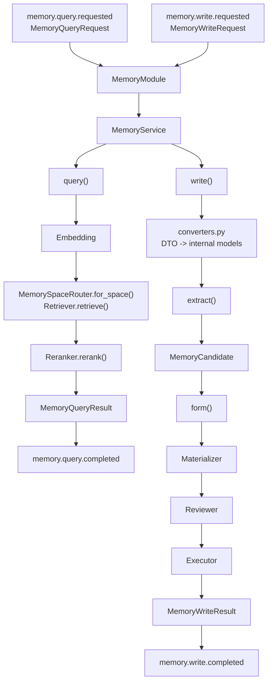

# Memory 核心开发指南

本文面向维护 `core.memory` 的开发者，帮助开发者理解长期记忆如何从公开请求进入 Extraction、Formation、Recall 和 Event 链路。其他 Module 的接入方式见[外部开发文档](../../../docs/modules/memory/README.md)。

## 1. 架构概览

Memory 是 SenaBot 的长期信息层。它不把自然语言直接写成数据库记录，而是先通过 Extract 提取候选，再通过 Form 的 materialize 形成受领域规则约束的 Payload，最后通过 Review 和 Executor 决定新增、结束事实有效期、替代旧版本或不做变更。



`MemoryModule` 只负责事件边界适配；`MemoryService` 负责编排业务阶段；`converters.py` 只做公开 DTO 与内部模型之间的转换；具体 LLM、向量检索和持久化都通过协议注入。

推荐阅读顺序：

1. `contracts.py`：公开请求、结果和失败事件 Payload；
2. `models.py`：Candidate、Payload、MemoryItem、Scope 和内部输入模型；
3. `service.py`：query、write、extract、form 的编排；
4. `converters.py`：DTO 与内部模型转换；
5. `events.py`：Memory 事件注册和 Handler；
6. `change_plan.py`、`executor.py`：变更计划和正式写入；
7. `extractor.py`、`materialization.py`、`reviewer.py`：LLM 边界；
8. `embedding.py`、`reranker.py`：查询/索引向量适配和基础重排实现。

## 2. 边界和文件职责

| 文件 | 职责 |
|---|---|
| `contracts.py` | 跨模块公开 DTO 和 Event Payload |
| `converters.py` | 公开 DTO 与 Memory 内部模型之间的纯转换 |
| `models.py` | Memory 领域模型和内部阶段输入 |
| `service.py` | Query、Write、Extraction、Formation 的业务编排 |
| `events.py` | MemoryModule 事件定义、订阅和 Handler |
| `protocols.py` | LLM、检索、重排、Review、Executor、Repository 等依赖协议 |
| `change_plan.py` | Review 输出的变更操作和结构不变量 |
| `executor.py` | ChangePlan 到 Repository 操作的执行 |
| `extractor.py` | LLM Extraction 实现 |
| `materialization.py` | Candidate 到 typed Payload 的 LLM 实现 |
| `reviewer.py` | Payload 与 related items 的审查 |
| `retriever.py` | MVP 内存检索器与 Memory Space Router |
| `embedding.py`、`reranker.py` | 查询向量、MemoryItem 索引向量与基础重排实现 |

必须保持的边界：

- 跨模块调用通过 Event 或 `contracts.py` 中的公开 DTO 表达；
- `converters.py` 不调用 LLM、不查库、不发布事件；
- `events.py` 不写业务流程，只把 Event 适配到 `MemoryService`；
- `MemoryService` 不依赖具体数据库、ORM 或全局 EventBus；
- Repository 只处理正式变更持久化，Recall 由 Retriever 完成；
- Agent 是否发言、如何披露记忆，不属于 Memory。

## 3. 公开 DTO 与内部模型

`contracts.py` 中的 DTO 是跨模块边界。它们描述调用方能确定的事实：

```text
MemoryQueryRequest / MemoryQueryResult
MemoryWriteRequest / MemoryWriteResult
MemoryQueryFailedEventData / MemoryWriteFailedEventData
```

`models.py` 中的对象是 Memory 内部领域模型：

```text
MemoryExtractionInput
MemoryCandidate
MemoryFormationInput
MemoryPayload
MemoryItem
MemoryWriteEnvelope
```

两者不能混用。比如 `MemoryWriteRequest` 表示“外部请求 Memory 判断这些消息是否应形成长期记忆”；`MemoryFormationInput` 表示“某个 Candidate 已进入 Formation 主链路”。前者不应携带 ChangePlan、related items 或 Repository 细节，后者也不应成为跨模块事件 Payload。

## 4. Query 链路

`query()` 执行当前确定的 Recall 主链路：

```text
MemoryQueryRequest
  -> embed(query_text)
  -> build query recall context
  -> memory_spaces.for_space(memory_space_id)
  -> retriever.retrieve(embedding, context)
  -> reranker.rerank(query_text, candidates)
  -> recall policy 过滤阈值并限制结果数量
  -> MemoryQueryResult(memories)
```

`memory_space_id` 先把请求路由到对应长期记忆空间；`MemoryRecallContext` 再在该空间内根据 USER、SESSION、GROUP Scope 做粗筛。Scope 命中只表示可作为候选进入 Recall，不表示可以直接对当前场景披露。

## 5. Write 链路

`write()` 是公开写入入口，负责串联 Extraction 与 Formation：

```text
MemoryWriteRequest
  -> converters.to_extraction_messages()
  -> extract()
  -> list[MemoryCandidate]
  -> converters.build_recall_context()
  -> converters.build_candidate_scopes()
  -> for each candidate: form()
  -> converters.to_write_result()
  -> MemoryWriteResult
```

`write()` 不把 `MemoryWriteRequest.messages` 直接入库。消息先进入 Extraction，只有 Extractor 产出的 Candidate 才能继续 Formation。返回空 Candidate 是正常结果，表示本次没有值得形成长期记忆的内容。

当前 `build_recall_context()` 和 `build_candidate_scopes()` 都复用同一套 Scope 构造，但语义不同：

- Recall Context：Formation 查询相关旧记忆时的候选边界；
- Candidate Scopes：新 MemoryItem 入库时的长期归属。

以后如果策略变成“查询更宽、写入更窄”，只需要调整 converter 或进一步拆出 scope policy。

## 6. Formation 链路

`form()` 只处理一个 Candidate：

```text
MemoryCandidate
  -> embed(candidate.content)
  -> retrieve related items
  -> materialize(candidate + related_items)
  -> review(payload + same related_items)
  -> execute(plan + same related_items + write context)
```

Materialization、Review 和 Executor 使用同一份 `related_items` 快照。这样一次形成过程中不会先用一批旧记忆生成 Payload，又用另一批旧记忆校验变更计划。

Executor 会调用 `MemoryChangePlan.validate_against(related_items)`，再把 Add、EndFactValidity、Supersede 转换为 Repository 操作。`NoMemoryChange` 不产生持久化调用。

新增或替代 MemoryItem 时，Executor 通过 Memory Indexer 选择领域检索文本并生成向量，再把 Item 和向量装入同一个 `MemoryWriteEnvelope`。Data 只负责原子保存，不解释 Fact、Experience 等领域内容。

## 7. Event 装配

`MemoryModule.register()` 注册 Memory 拥有的事件：

```text
memory.query.requested
memory.query.completed
memory.query.failed
memory.write.requested
memory.write.completed
memory.write.failed
```

并订阅：

```text
memory.query.requested -> MemoryService.query()
memory.write.requested -> MemoryService.write()
```

Handler 捕获业务调用中的异常后发布 failed 事件。未预期的 EventBus 注册、Payload 类型错误仍由 Event 层负责。Memory Handler 不应直接恢复 AgentRun，也不应依赖调用方是谁。

## 8. Memory Space 与 Scope

Memory Space 是长期记忆的上层隔离边界。当前 `MemorySpaceRouterProtocol.for_space(memory_space_id)` 路由到 Data 提供的 SQLite Retriever；测试仍可注入内存 Retriever。

Scope 是同一 Memory Space 内的长期主体归属。常见值为：

```text
USER(user_id)
SESSION(session_id)
GROUP(group_id)
GLOBAL
```

不要把二者混在一起：

- `memory_space_id` 决定先进入哪片记忆空间；
- `MemoryScopeRef` 决定这片空间内哪些 MemoryItem 可进入粗候选。

## 9. 测试与排错

Memory 测试位于 `tests/memory`。当前受影响链路可以运行：

```powershell
.\.venv\Scripts\python.exe -m pytest tests\memory\test_events.py tests\memory\test_formation.py
```

重点测试：

- `MemoryModule` 能从 request 事件发布 completed / failed；
- `MemoryService.query()` 按 Memory Space 路由并返回 MemoryItem；
- `MemoryService.write()` 先 Extraction，再逐个 Candidate Formation；
- Converter 不混入 LLM、检索或 Event 副作用；
- ChangePlan 的结构和 related items 校验仍由 Plan / Executor 承担。

排查时可以按事件链往后看：request 事件是否注册 → Handler 是否订阅 → Service 是否被调用 → Converter 是否生成正确内部输入 → LLM/检索/Repository 是否抛错 → completed 或 failed 是否发布。

## 10. 当前限制和提交检查

当前限制：

- Reranker 当前只按检索分数排序，尚未接入独立重排模型；
- 召回阈值需要根据实际 Embedding 模型继续校准；
- `operation_id` 只用于关联结果，不代表完整幂等；
- write 会对每个 Candidate 串行 Formation，尚未定义批量事务；
- `persona_id / bot_id -> memory_space_id` 的最终归属责任仍需跨模块确认；
- 记忆披露、安全判断和回复措辞由 Agent 或更高层处理。

提交前确认：

- [ ] 新公开事件已注册 payload type；
- [ ] Handler 只做 Event 到 Service 的适配；
- [ ] DTO 转内部模型的逻辑在 `converters.py`；
- [ ] `write()` 没有绕过 Extraction 直接入库；
- [ ] Formation 仍使用同一份 related items 快照；
- [ ] Memory Space 路由和 Scope 粗筛没有混用；
- [ ] 新契约已同步外部文档和测试。
